# ReAct Agents: Reasoning and Acting in Generative AI Applications
### - Govinda Ghimire

## Introduction

In the rapidly evolving landscape of generative artificial intelligence, the ability to not just reason about problems but also take concrete actions to solve them represents a fundamental shift in AI capabilities. ReAct (Reasoning and Acting) agents have emerged as a powerful paradigm that bridges the gap between pure language understanding and practical problem-solving, enabling AI systems to interact with the world in meaningful ways.

ReAct agents represent a synthesis of two critical AI capabilities: the reasoning power of large language models (LLMs) and the action-taking abilities that allow these models to interface with external tools, databases, and services. This combination has proven transformative for applications ranging from customer service chatbots to complex research assistants.

## Understanding ReAct: The Foundation

### What is ReAct?

ReAct, introduced by researchers at Princeton University and Google in 2022, is a framework that enables language models to generate both reasoning traces and task-specific actions in an interleaved manner. Unlike traditional approaches that separate reasoning and acting into distinct phases, ReAct allows models to dynamically alternate between thinking about a problem and taking actions to gather more information or make progress toward a solution.

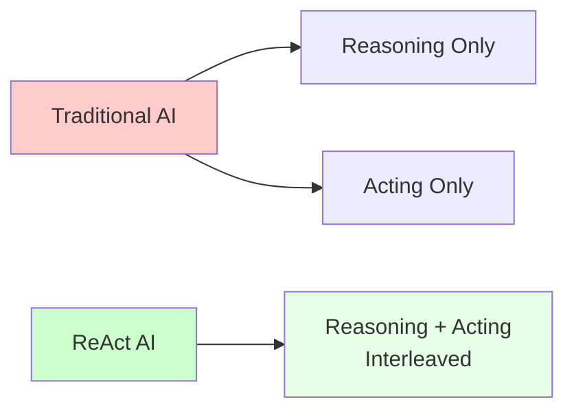

The core insight behind ReAct is that reasoning and acting should be tightly coupled processes. When humans solve complex problems, we don't simply reason in isolation—we gather information, test hypotheses, and iteratively refine our understanding based on the results of our actions. ReAct brings this natural problem-solving approach to AI systems.

### The ReAct Process Flow

A typical ReAct agent operates through a cyclical process:

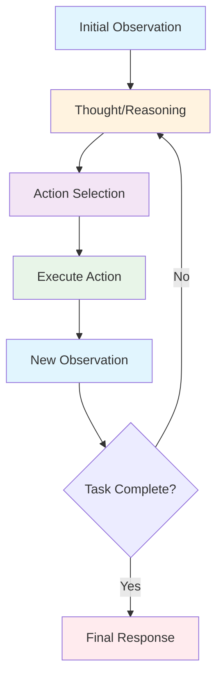

1. **Observation**: The agent receives initial input or observes the current state of the environment
2. **Thought**: The agent reasons about the situation, considering what it knows and what it needs to learn
3. **Action**: Based on its reasoning, the agent takes a specific action (such as searching for information, calling an API, or using a tool)
4. **Observation**: The agent observes the results of its action
5. **Repeat**: The cycle continues until the agent has sufficient information to provide a final answer or complete the task

This iterative approach allows agents to handle complex, multi-step problems that require gathering and synthesizing information from multiple sources.

## Core Components and Architecture

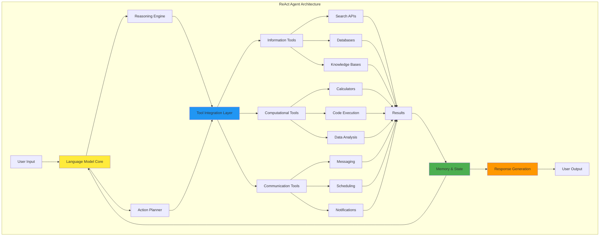

### Language Model Foundation

At the heart of every ReAct agent lies a capable language model, typically a large language model (LLM) such as GPT-4, Claude, or PaLM. These models provide the reasoning capabilities that allow agents to understand complex queries, break down problems into manageable steps, and generate appropriate actions based on context.

The language model serves multiple roles:
- **Query Understanding**: Parsing and comprehending user requests, including implicit requirements and constraints
- **Strategic Planning**: Determining the sequence of actions needed to solve a problem
- **Dynamic Reasoning**: Adapting the approach based on new information gathered through actions
- **Response Generation**: Synthesizing findings into coherent, helpful responses

### Tool Integration Layer

The "acting" component of ReAct agents is implemented through a tool integration layer that provides access to external resources and capabilities. Common tools include:

**Information Retrieval Tools**:
- Web search engines for finding current information
- Database query interfaces for structured data access
- Document retrieval systems for knowledge bases
- API endpoints for specialized data sources

**Computational Tools**:
- Calculators for mathematical operations
- Code execution environments for programming tasks
- Data analysis tools for processing datasets
- Simulation environments for testing scenarios

**Communication Tools**:
- Email and messaging interfaces
- Calendar and scheduling systems
- Notification and alert mechanisms
- Integration with external platforms and services

### Memory and State Management

Effective ReAct agents maintain context across multiple reasoning-action cycles. This requires sophisticated memory management that tracks:
- The original user request and goals
- Previous actions taken and their results
- Intermediate findings and partial solutions
- Failed attempts and lessons learned
- Current state of the problem-solving process

State management becomes particularly critical in long-running tasks or when agents need to maintain context across multiple user interactions.

## Benefits and Advantages

### Enhanced Problem-Solving Capabilities

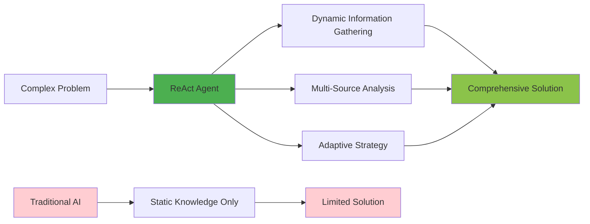

ReAct agents excel at handling complex, multi-faceted problems that require information gathering from multiple sources. Unlike static knowledge-based systems, they can dynamically adapt their approach based on what they discover during the problem-solving process.

For example, when asked to analyze market trends for a specific industry, a ReAct agent might:
1. Search for recent news articles about the industry
2. Access financial databases for quantitative data
3. Cross-reference findings with economic indicators
4. Synthesize insights from multiple perspectives
5. Provide a comprehensive analysis with supporting evidence

### Real-Time Information Access

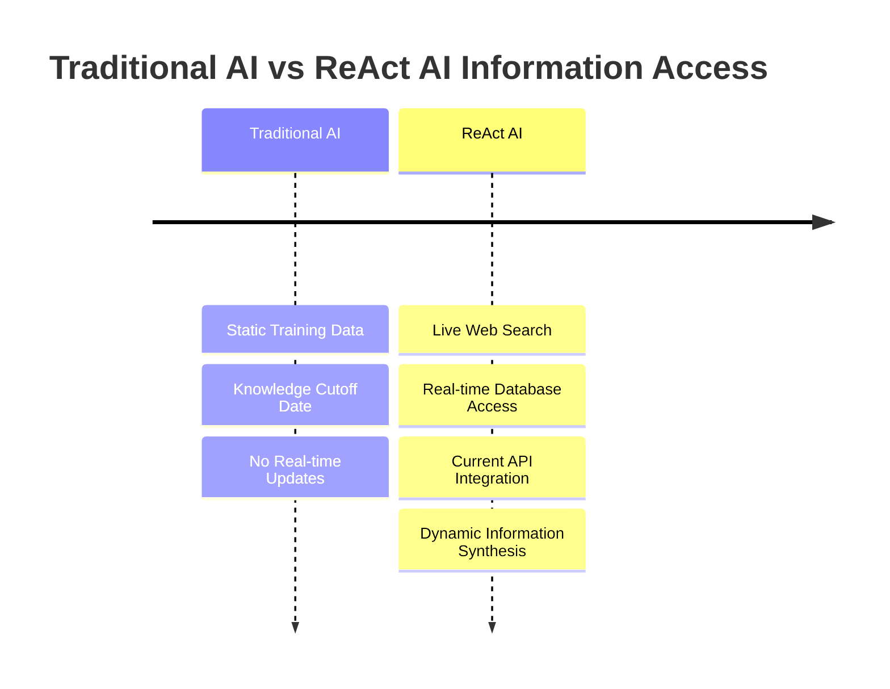

One of the most significant advantages of ReAct agents is their ability to access and incorporate real-time information. Traditional language models are limited by their training data cutoff, but ReAct agents can search the web, query databases, and access APIs to find the most current information available.

This capability is particularly valuable for:
- News and current events analysis
- Financial market information
- Weather and environmental data
- Product availability and pricing
- Regulatory and legal updates

### Transparency and Explainability

The interleaved reasoning and action structure of ReAct agents provides natural transparency into their decision-making process. Users can observe not just the final answer but also the reasoning steps and information sources that led to that conclusion.

This transparency offers several benefits:
- **Trust Building**: Users can verify the agent's reasoning and information sources
- **Error Detection**: Flawed reasoning or incorrect information can be identified and corrected
- **Learning Opportunities**: Users can understand how complex problems are approached and solved
- **Debugging**: Developers can identify where agents fail and improve their performance

### Adaptability and Extensibility

ReAct agents can be easily extended with new tools and capabilities without requiring fundamental changes to their architecture. As new APIs, databases, or services become available, they can be integrated into the agent's toolkit, immediately expanding its problem-solving capabilities.

This modularity also allows for domain-specific customization. A ReAct agent for financial services might integrate with trading platforms and market data feeds, while a healthcare-focused agent might connect to medical databases and diagnostic tools.

## Applications in Generative AI-Powered Applications

### Advanced Customer Service Chatbots

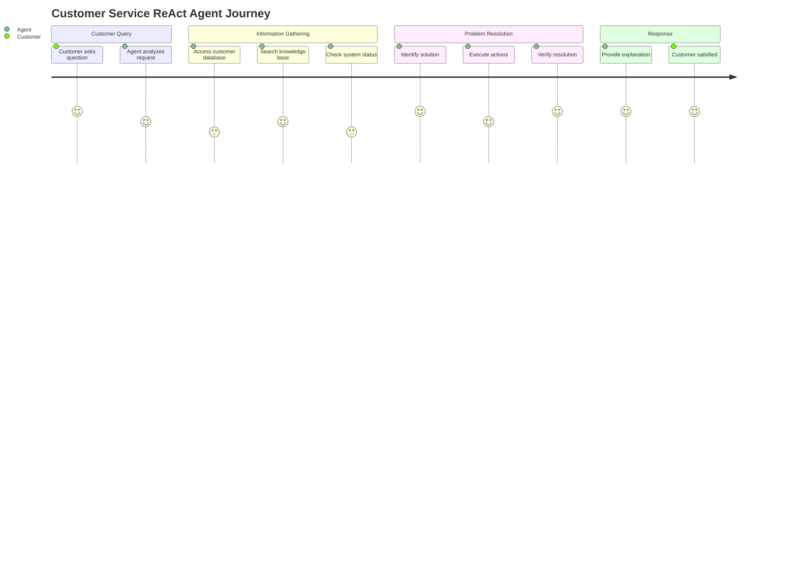

Modern customer service increasingly demands more than simple FAQ responses. ReAct agents can transform customer service by providing comprehensive, context-aware assistance that goes beyond scripted responses.

**Capabilities in Customer Service**:
- **Account Information Retrieval**: Accessing customer databases to provide account status, transaction history, and service details
- **Troubleshooting**: Using diagnostic tools and knowledge bases to identify and resolve technical issues
- **Product Recommendations**: Analyzing customer preferences and product catalogs to suggest relevant options
- **Policy and Procedure Guidance**: Searching company policies and procedures to provide accurate, up-to-date information
- **Escalation Management**: Determining when issues require human intervention and routing appropriately

**Example Scenario**: A customer contacts support about a billing discrepancy. A ReAct agent can:
1. Access the customer's account information
2. Review recent transactions and billing history
3. Check for known billing issues or system updates
4. Calculate corrected charges if errors are found
5. Process refunds or adjustments when authorized
6. Provide detailed explanations of the resolution

### Research and Analysis Assistants

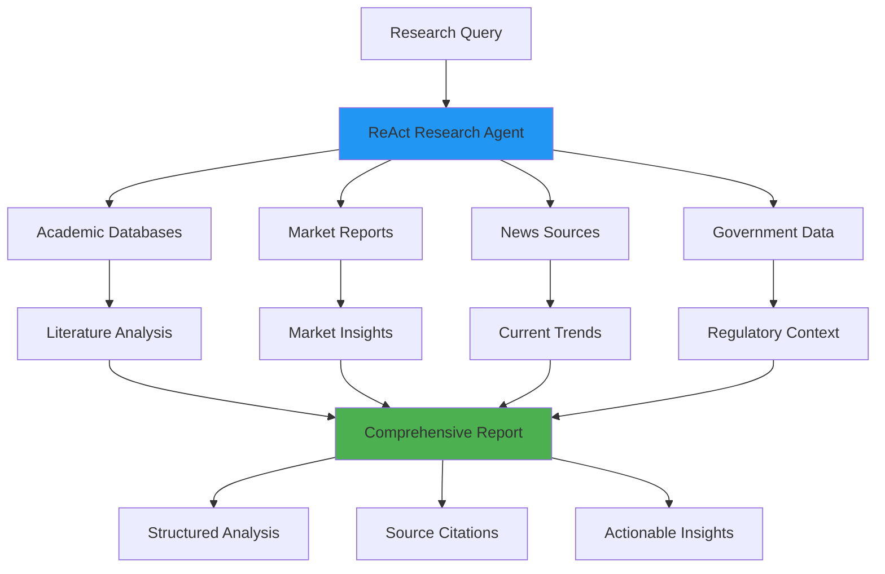

ReAct agents excel as research assistants, capable of conducting comprehensive investigations across multiple information sources and synthesizing findings into coherent reports.

**Research Capabilities**:
- **Literature Reviews**: Searching academic databases and analyzing research papers
- **Market Research**: Gathering data from multiple sources to analyze market conditions and trends
- **Competitive Analysis**: Collecting information about competitors, their products, and market positioning
- **Regulatory Research**: Staying current with changing regulations and compliance requirements
- **Technical Documentation**: Creating comprehensive documentation by gathering and organizing technical information

**Example Use Case**: A business analyst needs to understand the competitive landscape for electric vehicles in Southeast Asia. A ReAct agent can:
1. Search for market reports and industry analyses
2. Gather data on key players and their market share
3. Analyze pricing strategies and product offerings
4. Research regulatory environment and government incentives
5. Compile findings into a structured competitive analysis report

### Educational and Training Applications

In educational contexts, ReAct agents can serve as personalized tutors and learning assistants that adapt to individual student needs and learning styles.

**Educational Applications**:
- **Personalized Learning**: Adapting explanations and examples to match student comprehension levels
- **Research Guidance**: Teaching students how to find and evaluate information sources
- **Problem-Solving Instruction**: Demonstrating step-by-step approaches to complex problems
- **Assessment and Feedback**: Providing detailed feedback on student work and suggesting improvements
- **Curriculum Support**: Accessing educational resources and creating customized learning materials

### Content Creation and Management

Content creators and marketers can leverage ReAct agents to streamline content development processes and ensure accuracy and relevance.

**Content Applications**:
- **Fact-Checking**: Verifying claims and statistics used in content
- **Source Attribution**: Finding and citing appropriate sources for information
- **Content Optimization**: Analyzing performance data and suggesting improvements
- **Trend Analysis**: Identifying emerging topics and trends relevant to target audiences
- **Multi-Platform Publishing**: Adapting content for different platforms and formats

### Business Intelligence and Analytics

ReAct agents can serve as powerful business intelligence tools, capable of gathering data from multiple sources and providing actionable insights.

**Business Intelligence Features**:
- **Data Integration**: Combining information from various business systems and external sources
- **Trend Analysis**: Identifying patterns and trends in business data
- **Competitive Monitoring**: Tracking competitor activities and market changes
- **Performance Reporting**: Generating comprehensive reports on business metrics and KPIs
- **Predictive Analytics**: Using historical data and current trends to forecast future outcomes

## Implementation Considerations

### Technical Architecture Decisions

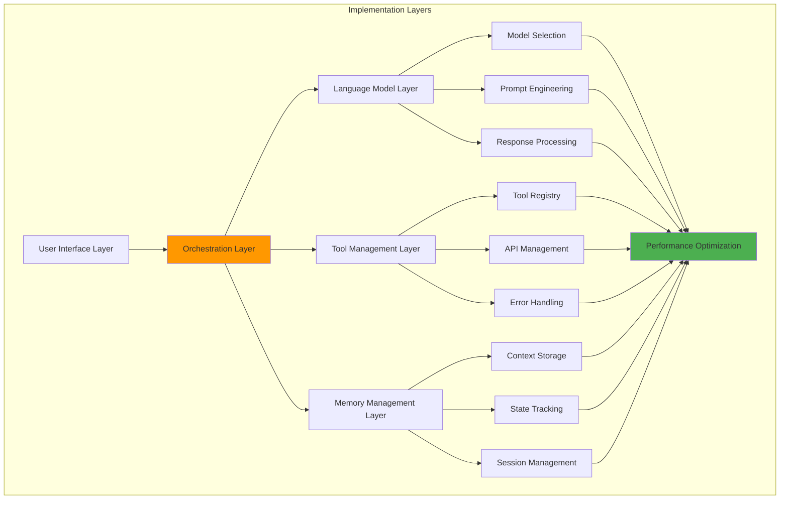

Implementing ReAct agents requires careful consideration of several technical factors:

**Model Selection**: Choosing appropriate language models based on reasoning capabilities, cost, and latency requirements. Considerations include model size, fine-tuning needs, and deployment constraints.

**Tool Integration**: Designing robust interfaces for external tools and services, including error handling, rate limiting, and authentication management.

**Orchestration Logic**: Implementing the core reasoning-action loop with appropriate decision-making algorithms for tool selection and action planning.

**Scalability**: Designing systems that can handle multiple concurrent agents and scale with increasing demand.

### Security and Privacy Concerns

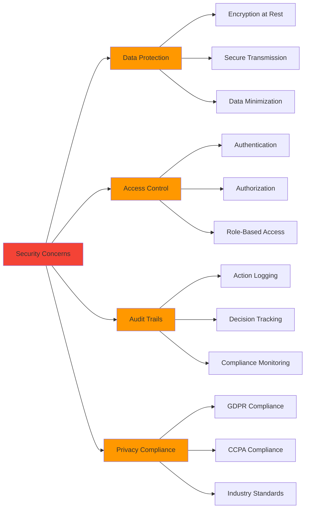

ReAct agents often access sensitive information and external services, raising important security considerations:

**Data Protection**: Ensuring that sensitive information accessed during agent operations is properly protected and not inadvertently exposed.

**Access Control**: Implementing appropriate authentication and authorization mechanisms for tool access and data retrieval.

**Audit Trails**: Maintaining comprehensive logs of agent actions for security monitoring and compliance purposes.

**Privacy Compliance**: Ensuring agent behavior complies with relevant privacy regulations such as GDPR, CCPA, and industry-specific requirements.

### Performance Optimization

Optimizing ReAct agent performance involves balancing thoroughness with efficiency:

**Latency Management**: Minimizing response times while ensuring comprehensive problem-solving. This may involve parallel tool execution, caching strategies, and intelligent action prioritization.

**Cost Optimization**: Managing the costs associated with language model inference and external API calls through efficient resource utilization and strategic caching.

**Quality Assurance**: Implementing mechanisms to ensure agent responses are accurate, relevant, and helpful, including validation steps and fallback procedures.

## Best Practices and Design Patterns

### Effective Prompt Engineering

The performance of ReAct agents heavily depends on well-crafted system prompts that guide reasoning and action selection:

**Clear Role Definition**: Explicitly defining the agent's role, capabilities, and limitations to set appropriate expectations and behavior patterns.

**Tool Usage Guidelines**: Providing clear instructions on when and how to use different tools, including error handling procedures and fallback strategies.

**Reasoning Structure**: Encouraging systematic thinking through structured prompts that promote thorough analysis and consideration of multiple perspectives.

**Output Formatting**: Specifying desired output formats to ensure consistency and usability of agent responses.

### Error Handling and Resilience

Robust ReAct agents must gracefully handle various types of failures:

**Tool Failures**: Implementing fallback mechanisms when external services are unavailable or return errors.

**Information Gaps**: Strategies for handling situations where required information cannot be found or accessed.

**Reasoning Errors**: Mechanisms for detecting and correcting logical inconsistencies or factual errors in agent reasoning.

**User Clarification**: Procedures for seeking clarification when user requests are ambiguous or incomplete.

### Continuous Improvement

ReAct agents benefit from continuous monitoring and improvement:

**Performance Metrics**: Establishing key performance indicators to measure agent effectiveness, including accuracy, completeness, and user satisfaction.

**Feedback Loops**: Implementing mechanisms to collect and incorporate user feedback into agent improvement processes.

**Knowledge Updates**: Procedures for updating agent knowledge and capabilities as new information and tools become available.

**A/B Testing**: Systematic testing of different approaches and configurations to optimize agent performance.

## Future Directions and Emerging Trends

### Multi-Agent Collaboration

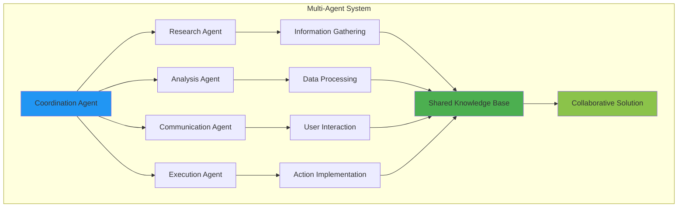

The future of ReAct agents likely involves sophisticated multi-agent systems where specialized agents collaborate to solve complex problems:

**Specialized Agents**: Different agents with expertise in specific domains working together on multifaceted problems.

**Coordination Mechanisms**: Protocols for agents to communicate, share information, and coordinate their actions effectively.

**Hierarchical Organization**: Systems where higher-level agents delegate tasks to specialized sub-agents and synthesize their results.

### Enhanced Reasoning Capabilities

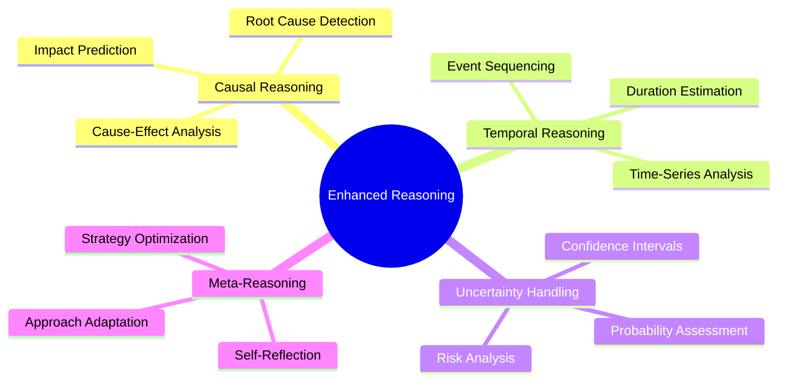

Ongoing research aims to improve the reasoning capabilities of ReAct agents:

**Causal Reasoning**: Better understanding of cause-and-effect relationships to improve problem-solving accuracy.

**Temporal Reasoning**: Enhanced ability to reason about time-dependent information and processes.

**Uncertainty Handling**: Improved methods for dealing with incomplete or conflicting information.

**Meta-Reasoning**: Agents that can reason about their own reasoning processes and optimize their problem-solving approaches.

### Integration with Emerging Technologies

ReAct agents are likely to integrate with emerging technologies to expand their capabilities:

**Computer Vision**: Incorporating visual analysis capabilities for processing images, videos, and visual data.

**Internet of Things (IoT)**: Connecting with IoT devices and sensors for real-world data collection and control.

**Blockchain and Web3**: Integration with decentralized systems for secure, transparent operations.

**Augmented and Virtual Reality**: Supporting immersive experiences and spatial computing applications.

## Challenges and Limitations

### Technical Challenges

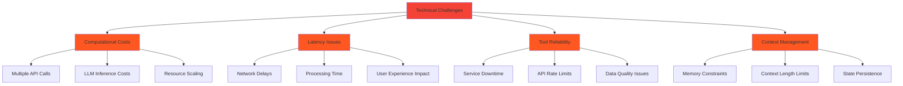

Despite their capabilities, ReAct agents face several technical limitations:

**Computational Costs**: The iterative nature of ReAct agents can result in high computational costs, particularly when multiple reasoning-action cycles are required.

**Latency Issues**: The need to make external API calls and process responses can introduce significant delays in agent responses.

**Tool Reliability**: Agent performance is limited by the reliability and availability of external tools and services.

**Context Management**: Maintaining context across long interaction sequences can be challenging and resource-intensive.

### Ethical and Social Considerations

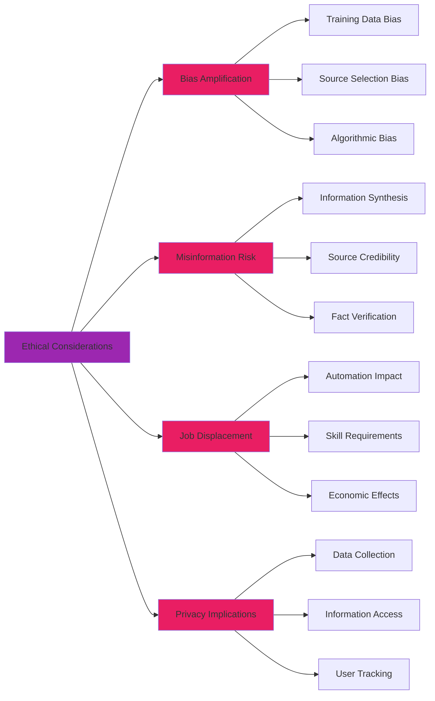

The deployment of ReAct agents raises important ethical questions:

**Bias Amplification**: Agents may perpetuate or amplify biases present in their training data or external information sources.

**Misinformation Spread**: The ability to access and synthesize information from multiple sources could potentially lead to the spread of misinformation if not properly controlled.

**Job Displacement**: As agents become more capable, they may displace human workers in various roles, raising economic and social concerns.

**Privacy Implications**: The extensive data access capabilities of ReAct agents raise concerns about privacy and data protection.

## Conclusion

ReAct agents represent a significant advancement in the capabilities of AI systems, bridging the gap between reasoning and action to create more practical and effective AI applications. Their ability to dynamically gather information, reason about complex problems, and provide transparent, explainable solutions makes them particularly valuable in today's information-rich environment.

As we continue to develop and deploy ReAct agents, success will depend on thoughtful implementation that addresses technical challenges while considering ethical implications and user needs. The integration of reasoning and acting capabilities opens new possibilities for AI applications, from sophisticated customer service systems to powerful research assistants and beyond.

The future of ReAct agents lies in continued advancement of their reasoning capabilities, improved integration with external tools and services, and the development of multi-agent systems that can tackle increasingly complex challenges. As these systems mature, they will likely become integral components of many digital experiences, providing users with intelligent, capable assistants that can navigate the complexity of our interconnected world.

Organizations considering the implementation of ReAct agents should focus on clear use case definition, robust security practices, and continuous improvement processes. With careful planning and execution, ReAct agents can deliver significant value while maintaining the trust and confidence of users in an increasingly AI-powered world.
