# How to Survive as a Data Scientist in 2025: The Ultimate Survival Guide

*A comprehensive analysis of trends, challenges, and strategies for thriving in the evolving data science landscape*

---

## Executive Summary

The data science field is experiencing unprecedented transformation in 2025. While the global data science market is projected to grow from $174.10 billion in 2025 to $651 billion by 2034, reflecting a CAGR of 16.2%, professionals face new challenges from AI automation, evolving skill requirements, and increased competition. This guide provides actionable strategies for not just surviving, but thriving in this dynamic environment.

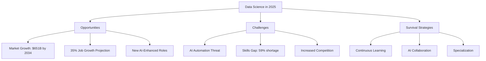

---

## Chapter 1: The Current Landscape - Understanding the 2025 Data Science Ecosystem

### Market Reality Check

The data science job market in 2025 presents a paradox of explosive growth alongside intense competition. About 21,000 new data science job openings are projected each year over the next decade, yet 59% of professionals identify a lack of data science expertise as a primary barrier to fully leveraging AI's potential.

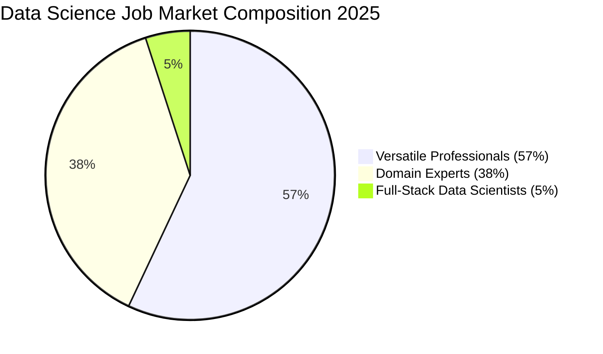

### Salary Landscape

Despite challenges, compensation remains attractive:

| Salary Range | Percentage of Jobs | Trend |
|--------------|-------------------|-------|
| $160,000 - $200,000 | 32% | ↑ Most common range |
| $120,000 - $160,000 | 27% | ↗ Second most common |
| $200,000+ | 15% | ↗ Growing for specialists |
| Under $120,000 | 26% | ↓ Decreasing |

### Regional Variations

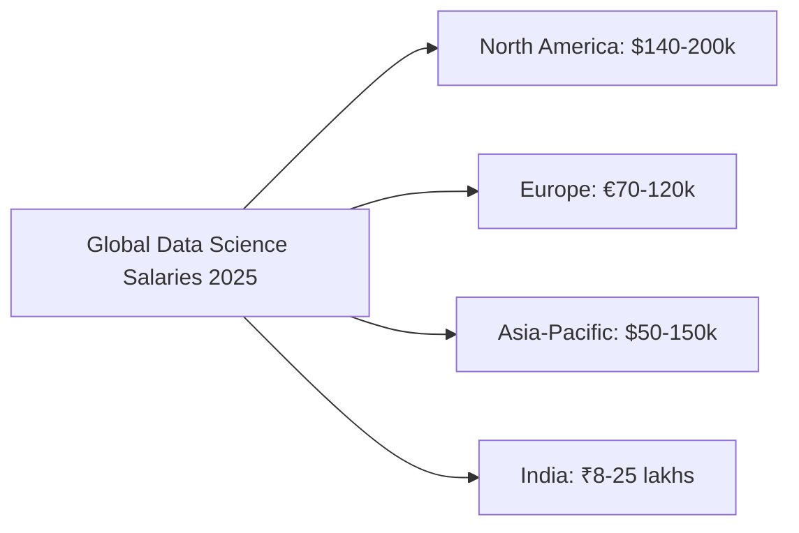

---

## Chapter 2: The AI Revolution - Threat or Opportunity?

### The Automation Reality

94% of data and AI leaders said that interest in AI is leading to a greater focus on data, fundamentally changing how data scientists work. However, contrary to apocalyptic predictions, data scientists constituted merely 3% of those laid off by major tech companies during recent layoffs.

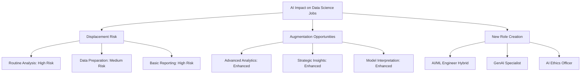

### AI as a Collaborative Tool

Rather than replacement, successful data scientists are learning to collaborate with AI:

#### Current AI Collaboration Patterns:
- **Code Generation**: 78% use AI for code snippets
- **Data Exploration**: 65% use AI for initial analysis
- **Documentation**: 72% use AI for report writing
- **Research**: 58% use AI for literature reviews

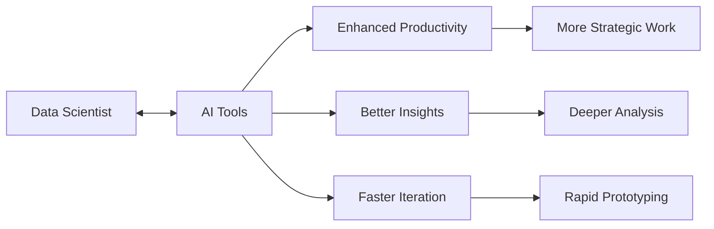

---

## Chapter 3: Critical Skills for 2025 and Beyond

### The Evolving Skill Stack

The 2025 job market demands data science skills in programming languages like Python and SQL, machine learning and AI expertise, cloud computing skills (AWS, Azure, Google Cloud), data visualization, and strong communication abilities.

#### Programming Languages Priority Matrix

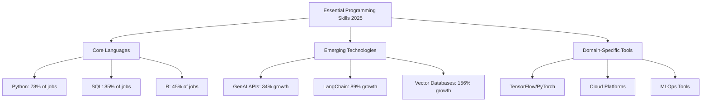

### Technical Skills Hierarchy

| Skill Category | Critical Skills | Market Demand | Salary Impact |
|----------------|----------------|---------------|---------------|
| **Core Programming** | Python, SQL, R | Very High | +15-25% |
| **Machine Learning** | Scikit-learn, TensorFlow, PyTorch | High | +20-35% |
| **Cloud Platforms** | AWS, Azure, GCP | Growing | +25-40% |
| **GenAI/LLMs** | OpenAI API, LangChain, RAG | Explosive | +35-50% |
| **MLOps** | Docker, Kubernetes, Airflow | Medium-High | +30-45% |

### Soft Skills That Matter

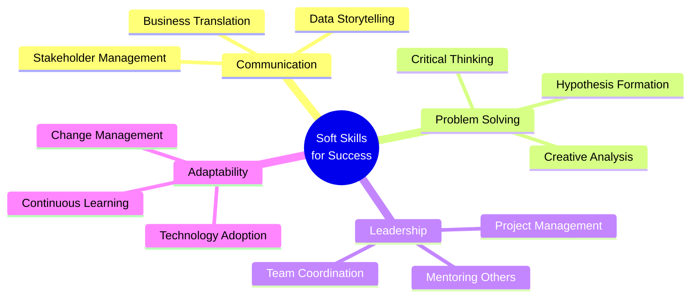

---

## Chapter 4: The Top 8 Challenges Facing Data Scientists in 2025

### Challenge 1: Data Quality and Preparation

Data scientists spend about 80% of their time on data preparation, cleaning, and integration tasks, also known as data wrangling. This remains the most cited frustration.

**Survival Strategy:**
- Master automated data cleaning tools (Great Expectations, Pandas Profiling)
- Learn data validation frameworks
- Develop standardized preprocessing pipelines

### Challenge 2: The Skills Gap Crisis

59% of professionals identify a lack of data science expertise as a primary barrier, creating a supply-demand imbalance.

**Survival Strategy:**
- Focus on high-demand skills (GenAI, MLOps, Cloud)
- Obtain relevant certifications
- Build a portfolio showcasing diverse projects

### Challenge 3: AI Automation Pressure

While not immediately threatening, automation is reshaping the field.

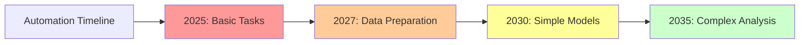

**Survival Strategy:**
- Focus on strategic, interpretive work
- Develop domain expertise
- Learn to work alongside AI tools

### Challenge 4: Unrealistic Expectations

The lack of understanding of data science among management teams leads to unrealistic expectations on the data scientist.

**Survival Strategy:**
- Improve communication skills
- Set clear project boundaries
- Educate stakeholders on data science limitations

### Challenge 5: Data Security and Privacy

With increasing regulations and privacy concerns, data scientists must navigate complex compliance requirements.

**Survival Strategy:**
- Learn GDPR, CCPA compliance
- Understand data anonymization techniques
- Implement privacy-preserving ML methods

### Challenge 6: Tool and Technology Overload

The rapidly evolving technology landscape creates decision paralysis.

**Survival Strategy:**
- Focus on fundamentals over trends
- Choose versatile, well-supported tools
- Build T-shaped expertise (broad knowledge, deep specialty)

### Challenge 7: Collaboration Difficulties

Data science projects require cross-functional collaboration, which many find challenging.

**Survival Strategy:**
- Develop project management skills
- Learn agile methodologies
- Practice stakeholder communication

### Challenge 8: Career Path Ambiguity

Data scientists don't often have precise role requirements for their job, leading to career uncertainty.

**Survival Strategy:**
- Define your own specialization
- Seek mentorship and guidance
- Build a personal brand in your chosen niche

---

## Chapter 5: Emerging Trends and Technologies to Master

### Trend 1: Generative AI Integration

By 2025, AI will be able to provide fully personalized experiences based on individual needs.

#### Key Technologies to Learn:
- Large Language Models (LLMs)
- Retrieval-Augmented Generation (RAG)
- Prompt Engineering
- Fine-tuning Techniques

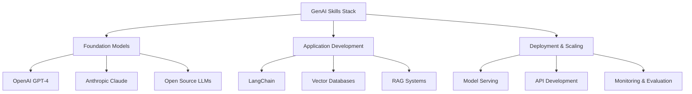

### Trend 2: Real-Time Analytics and Edge Computing

Growth of real-time analytics is driven by the rising adoption of Internet of Things and edge computing.

#### Technologies to Focus On:
- Apache Kafka and Flink
- Edge AI frameworks
- Streaming analytics platforms
- IoT data processing

### Trend 3: AutoML and Democratization

AutoML streamlines and automates the process of applying machine learning models, changing how data science is practiced.

#### Strategic Response:
- Learn to use AutoML tools effectively
- Focus on problem formulation and interpretation
- Develop skills in model evaluation and selection

### Trend 4: Cloud-Native Data Science

44% of traditional small businesses utilize cloud infrastructure or hosting services, with enterprise adoption at 74%.

#### Essential Cloud Skills:
- Containerization (Docker, Kubernetes)
- Serverless computing
- Cloud-native ML platforms
- Infrastructure as Code (IaC)

### Trend 5: Data Mesh and Governance

Organizations are adopting data mesh architectures and enhanced governance frameworks.

#### Key Concepts:
- Data contracts and SLAs
- Data lineage tracking
- Privacy-preserving analytics
- Federated data architectures

---

## Chapter 6: Building Your Survival Strategy

### The T-Shaped Professional Model

```mermaid
graph TD
    A[T-Shaped Data Scientist] --> B[Broad Knowledge Base]
    A --> C[Deep Specialization]
    
    B --> B1[Statistics & Math]
    B --> B2[Programming Basics]
    B --> B3[Business Acumen]
    B --> B4[Communication]
    
    C --> C1[Choose Your Specialty]
    C1 --> D1[NLP/GenAI Expert]
    C1 --> D2[Computer Vision Specialist]
    C1 --> D3[MLOps Engineer]
    C1 --> D4[Domain Expert (Healthcare, Finance, etc.)]
```

### Continuous Learning Framework

#### The 70-20-10 Learning Model
- **70% Learning by Doing**: Work on real projects, contribute to open source
- **20% Learning from Others**: Mentorship, peer collaboration, conferences
- **10% Formal Learning**: Courses, certifications, reading

### Building Your Professional Portfolio

#### Essential Portfolio Components:

1. **End-to-End Projects**
   - Business problem identification
   - Data collection and cleaning
   - Model development and evaluation
   - Deployment and monitoring

2. **GenAI Applications**
   - RAG system implementation
   - Custom chatbot development
   - LLM fine-tuning projects

3. **MLOps Demonstrations**
   - CI/CD pipeline for ML models
   - Model monitoring and retraining
   - A/B testing frameworks

4. **Domain Expertise Showcase**
   - Industry-specific projects
   - Regulatory compliance examples
   - Business impact documentation

---

## Chapter 7: Networking and Career Development

### Building Your Professional Network

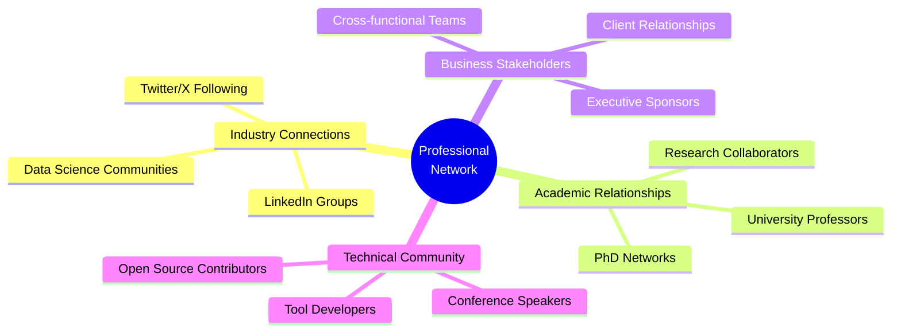

### Key Communities to Join:

- **Kaggle**: Competitions and datasets
- **GitHub**: Open source contributions
- **Reddit**: r/MachineLearning, r/datascience
- **Discord/Slack**: Data science communities
- **Professional Organizations**: KDD, INFORMS, etc.

### Conference and Event Strategy

#### Must-Attend Events 2025:
- **NeurIPS**: Core ML research
- **ICML**: Machine learning advances
- **Strata Data**: Industry applications
- **MLOps World**: Production ML
- **AI Summit**: Enterprise AI

---

## Chapter 8: The Future-Proof Career Path

### Career Trajectory Options

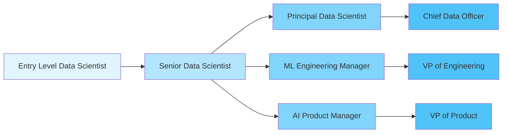

### Specialization Paths

#### Path 1: Technical Leadership
- Focus: Advanced algorithms, research, innovation
- Skills: Deep ML/AI, research methodology, technical mentoring
- Timeline: 7-10 years to principal level

#### Path 2: Product-Focused
- Focus: Business impact, user experience, product development
- Skills: Product management, user research, business strategy
- Timeline: 5-7 years to product leadership

#### Path 3: Consulting/Freelancing
- Focus: Cross-industry expertise, client management
- Skills: Business development, presentation, diverse domain knowledge
- Timeline: 3-5 years to establish practice

#### Path 4: Entrepreneurship
- Focus: Building data-driven products/services
- Skills: Business planning, fundraising, team building
- Timeline: Variable, high risk/reward

### Geographic Considerations

#### Top Markets for Data Scientists 2025:

| Location | Avg Salary | Job Growth | Cost of Living | AI Hub Status |
|----------|------------|------------|----------------|---------------|
| San Francisco | $185k | 15% | Very High | Primary |
| New York | $165k | 18% | Very High | Primary |
| Seattle | $155k | 22% | High | Primary |
| Austin | $135k | 25% | Medium-High | Emerging |
| Boston | $145k | 12% | High | Established |
| Remote | $125k | 35% | Variable | Growing |

---

## Chapter 9: Practical Action Plan for 2025

### 90-Day Quick Start Plan

#### Days 1-30: Assessment and Foundation
- **Week 1**: Skills gap analysis using job market data
- **Week 2**: Set up learning environment (cloud accounts, tools)
- **Week 3**: Choose specialization based on interests and market demand
- **Week 4**: Begin first major project or learning path

#### Days 31-60: Skill Building
- **Week 5-6**: Core skill development (Python, SQL, cloud basics)
- **Week 7-8**: Specialized learning (GenAI, MLOps, domain expertise)

#### Days 61-90: Application and Networking
- **Week 9-10**: Portfolio project completion
- **Week 11-12**: Network building and job application (if seeking new role)

### Annual Learning Calendar

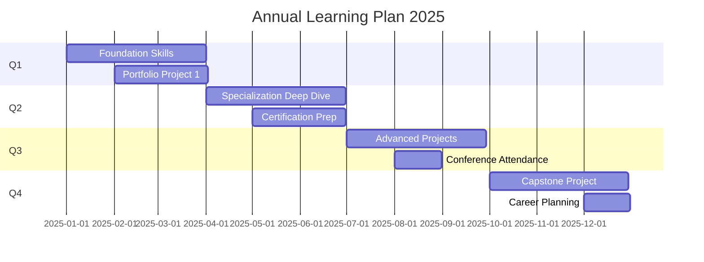

### Budget Planning for Professional Development

#### Annual Investment Recommendations:

| Category | Budget Range | ROI Timeline | Examples |
|----------|-------------|--------------|----------|
| **Courses & Certifications** | $2,000-5,000 | 6-12 months | AWS ML, Google Cloud ML |
| **Tools & Software** | $1,000-3,000 | Immediate | Cloud credits, software licenses |
| **Conferences & Events** | $3,000-8,000 | 3-6 months | Travel, registration, networking |
| **Books & Resources** | $500-1,000 | 1-3 months | Technical books, subscriptions |
| **Hardware** | $2,000-5,000 | 2-3 years | GPU workstation, laptop upgrade |

---

## Chapter 10: Common Pitfalls and How to Avoid Them

### Pitfall 1: Technology Chasing
**Problem**: Constantly jumping to new tools without mastering fundamentals
**Solution**: Build strong foundations first, then selectively adopt new technologies

### Pitfall 2: Isolation
**Problem**: Working in silos without stakeholder engagement
**Solution**: Regularly communicate with business users and seek feedback

### Pitfall 3: Perfectionism
**Problem**: Over-engineering solutions, never shipping projects
**Solution**: Embrace MVPs and iterative improvement

### Pitfall 4: Narrow Specialization Too Early
**Problem**: Limiting career options by specializing too quickly
**Solution**: Build broad foundation before choosing specialization

### Pitfall 5: Ignoring Business Context
**Problem**: Creating technically impressive but business-irrelevant solutions
**Solution**: Always start with business problem definition

---

## Conclusion: Your Data Science Survival Manifesto

The data science landscape of 2025 is both challenging and full of opportunity. Success requires a strategic approach that balances technical excellence with business acumen, embraces AI collaboration rather than fearing it, and maintains a commitment to continuous learning.

### Your Survival Checklist:

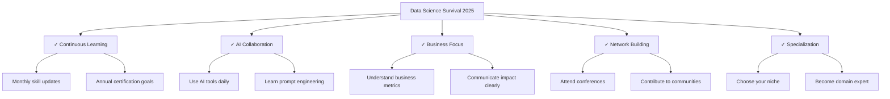

Remember: Organizations using analytics were able to improve their performance and increase their profit by up to 126%. The demand for skilled data scientists who can deliver this value will continue to grow.

The future belongs to data scientists who can:
- **Adapt** to technological change
- **Collaborate** with AI systems
- **Communicate** business value
- **Create** innovative solutions
- **Connect** technical work to business outcomes

Your survival isn't just about keeping your job—it's about thriving in one of the most exciting and impactful fields of the 21st century. The tools, strategies, and mindset outlined in this guide will help you not just survive, but lead the next wave of data-driven innovation.

---

*"The best time to plant a tree was 20 years ago. The second best time is now."* - The same applies to your data science career development. Start today, stay consistent, and thrive in 2025 and beyond.

---

### Additional Resources

- **Online Platforms**: Coursera, Udacity, DataCamp, Pluralsight
- **Books**: "Hands-On Machine Learning" by Aurélien Géron, "The Data Science Handbook"
- **Communities**: Kaggle, Stack Overflow, Data Science Central
- **Podcasts**: "Data Skeptic", "Linear Digressions", "The AI Podcast"
- **Newsletters**: "The Batch" by DeepLearning.AI, "Data Science Weekly"

*Last Updated: June 2025*
