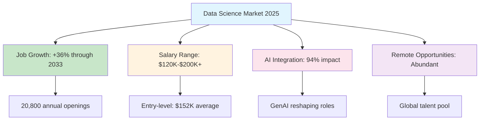
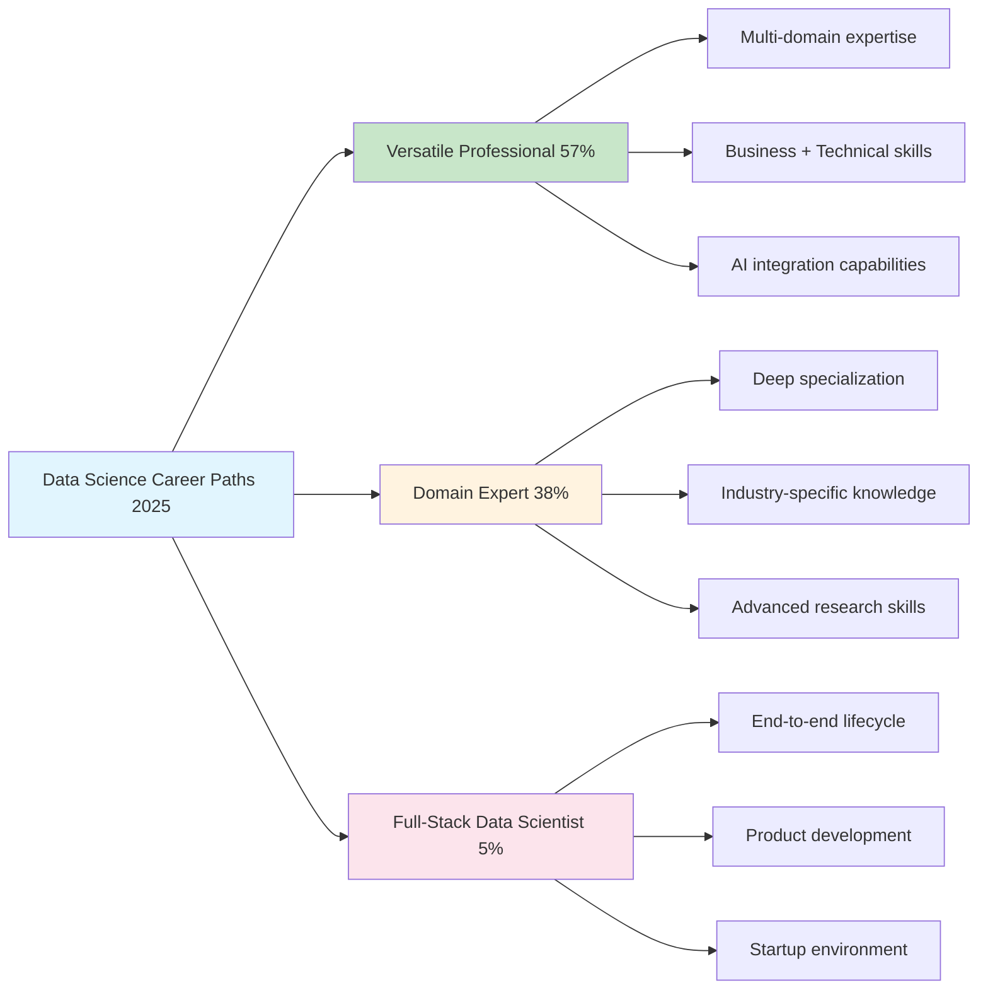
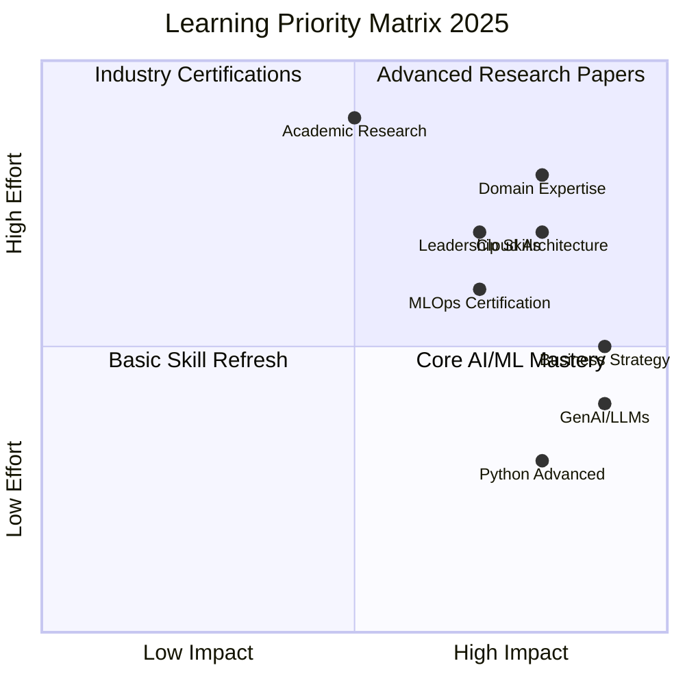
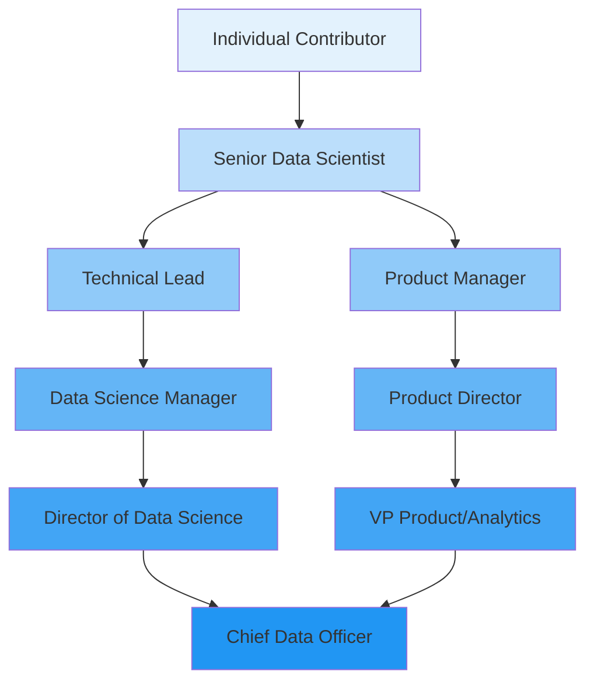
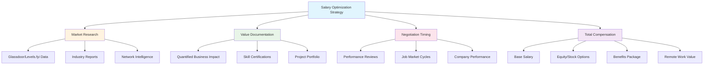
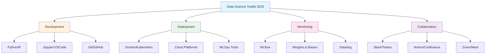

# How to Survive as a Data Scientist in 2025: The Complete Survival Guide

*A comprehensive, research-backed roadmap for thriving in an AI-transformed data science landscape*

## Executive Summary

The data science field in 2025 presents both unprecedented opportunities and formidable challenges. While salary trends show a high-value market: The majority (32%) of data science jobs in 2025 offer salaries between $160,000 - $200,000, with $120,000 - $160,000 following closely at 27%, the landscape has fundamentally shifted. By 2025, this pattern has reversed: entry-level positions (0-2 years) are now least common, followed by 6-8 years and 8+ years of experience. This reflects a shift in the data science job market, with employers now favoring experienced professionals over newcomers.

**Bottom Line Up Front**: Survival in 2025 requires evolution from traditional data scientist to AI-augmented professional who masters both technical excellence and strategic business impact.

---

## 📊 The Current State: A Data-Driven Reality Check

### Market Dynamics and Growth Trajectory



The data science profession continues to show remarkable resilience and growth. Employment of data scientists is projected to grow 36 percent from 2023 to 2033, much faster than the average for all occupations. About 20,800 openings for data scientists are projected each year, on average, over the decade.

However, the nature of these opportunities has evolved dramatically:

#### **Salary Intelligence**
- Entry-level positions now averaging $152,000—up by $40,000 from 2024
- The most frequently mentioned salary range in our data was $160K-$200K
- Premium compensation for AI and ML expertise driving market differentiation

#### **Geographic Distribution and Remote Work**
The pandemic permanently altered work patterns, with Several cities have open remote data scientist jobs. Some of the top ones include Hyderabad, Bangalore, Kolkata , Pune. Consider applying to Turing for remote data science positions. Turing offers full-time, long-term data scientist roles that you can pursue from anywhere in the world.

### The AI Disruption Reality

```svg
<svg viewBox="0 0 800 400" xmlns="http://www.w3.org/2000/svg">
  <!-- Background -->
  <rect width="800" height="400" fill="#f8f9fa"/>
  
  <!-- Title -->
  <text x="400" y="30" text-anchor="middle" font-family="Arial, sans-serif" font-size="20" font-weight="bold" fill="#2c3e50">AI Impact on Data Science Jobs: The Double-Edged Sword</text>
  
  <!-- Threat Side -->
  <rect x="50" y="60" width="300" height="300" fill="#ffebee" stroke="#e57373" stroke-width="2" rx="10"/>
  <text x="200" y="85" text-anchor="middle" font-family="Arial, sans-serif" font-size="16" font-weight="bold" fill="#c62828">THREATS</text>
  
  <!-- Threat Points -->
  <circle cx="80" cy="110" r="3" fill="#e57373"/>
  <text x="95" y="115" font-family="Arial, sans-serif" font-size="12" fill="#424242">26% drop in traditional DS job openings</text>
  
  <circle cx="80" cy="135" r="3" fill="#e57373"/>
  <text x="95" y="140" font-family="Arial, sans-serif" font-size="12" fill="#424242">Entry-level positions declining</text>
  
  <circle cx="80" cy="160" r="3" fill="#e57373"/>
  <text x="95" y="165" font-family="Arial, sans-serif" font-size="12" fill="#424242">Role fragmentation into cheaper titles</text>
  
  <circle cx="80" cy="185" r="3" fill="#e57373"/>
  <text x="95" y="190" font-family="Arial, sans-serif" font-size="12" fill="#424242">AutoML reducing barrier to entry</text>
  
  <circle cx="80" cy="210" r="3" fill="#e57373"/>
  <text x="95" y="215" font-family="Arial, sans-serif" font-size="12" fill="#424242">Code generation tools</text>
  
  <circle cx="80" cy="235" r="3" fill="#e57373"/>
  <text x="95" y="240" font-family="Arial, sans-serif" font-size="12" fill="#424242">Big Tech hiring freezes</text>
  
  <!-- Opportunity Side -->
  <rect x="450" y="60" width="300" height="300" fill="#e8f5e8" stroke="#81c784" stroke-width="2" rx="10"/>
  <text x="600" y="85" text-anchor="middle" font-family="Arial, sans-serif" font-size="16" font-weight="bold" fill="#2e7d32">OPPORTUNITIES</text>
  
  <!-- Opportunity Points -->
  <circle cx="480" cy="110" r="3" fill="#81c784"/>
  <text x="495" y="115" font-family="Arial, sans-serif" font-size="12" fill="#424242">AI/ML roles growing 77% demand</text>
  
  <circle cx="480" cy="135" r="3" fill="#81c784"/>
  <text x="495" y="140" font-family="Arial, sans-serif" font-size="12" fill="#424242">NLP skills jumping from 5% to 19%</text>
  
  <circle cx="480" cy="160" r="3" fill="#81c784"/>
  <text x="495" y="165" font-family="Arial, sans-serif" font-size="12" fill="#424242">Data engineering hybrid roles</text>
  
  <circle cx="480" cy="185" r="3" fill="#81c784"/>
  <text x="495" y="190" font-family="Arial, sans-serif" font-size="12" fill="#424242">Strategic AI implementation</text>
  
  <circle cx="480" cy="210" r="3" fill="#81c784"/>
  <text x="495" y="215" font-family="Arial, sans-serif" font-size="12" fill="#424242">Cross-functional expertise premium</text>
  
  <circle cx="480" cy="235" r="3" fill="#81c784"/>
  <text x="495" y="240" font-family="Arial, sans-serif" font-size="12" fill="#424242">Remote work global access</text>
  
  <!-- Arrow -->
  <path d="M 360 200 L 440 200" stroke="#666" stroke-width="3" marker-end="url(#arrowhead)"/>
  <defs>
    <marker id="arrowhead" markerWidth="10" markerHeight="7" refX="10" refY="3.5" orient="auto">
      <polygon points="0 0, 10 3.5, 0 7" fill="#666"/>
    </marker>
  </defs>
  <text x="400" y="195" text-anchor="middle" font-family="Arial, sans-serif" font-size="11" font-weight="bold" fill="#666">ADAPTATION</text>
</svg>
```

In the 2025 AI & Data Leadership Executive Benchmark Survey, 94% of data and AI leaders said that interest in AI is leading to a greater focus on data. This represents both the challenge and opportunity: while AI threatens to automate routine data science tasks, it simultaneously creates demand for professionals who can strategically implement and manage AI systems.

---

## 🎯 Survival Strategy #1: Master the New Essential Skills Framework

### The 2025 Skills Hierarchy

```mermaid
pyramid:
    title Skills Pyramid for Data Science Survival 2025
    
    section Strategic Leadership
        desc Business Strategy & AI Ethics
        value 10
    
    section AI Integration Mastery
        desc GenAI, LLMs, Prompt Engineering
        value 25
        
    section Advanced Technical Core
        desc MLOps, Cloud Architecture, Real-time Systems
        value 35
        
    section Foundation Plus
        desc Python, SQL, Statistics + Domain Expertise
        value 30
```

### Core Technical Competencies

#### **1. Programming Excellence with AI Integration**
Python remains the go-to language for data scientists because of its versatility, ease of learning, and vast library ecosystem. However, the bar has been raised:

**Essential 2025 Python Stack:**
- Core: pandas, NumPy, scikit-learn, matplotlib/seaborn
- ML/DL: TensorFlow, PyTorch, Hugging Face Transformers
- MLOps: MLflow, Weights & Biases, Apache Airflow
- Cloud: boto3 (AWS), azure-ml-sdk, google-cloud-ai

#### **2. The SQL-Plus Database Mastery**
SQL (Structured Query Language) is essential for extracting data from databases. Data scientists must know how to write efficient SQL queries to retrieve, filter, and manipulate data stored in relational databases.

**Advanced SQL Requirements:**
- Window functions and CTEs
- Performance optimization and indexing
- NoSQL databases (MongoDB, Cassandra)
- Vector databases for AI applications (Pinecone, Weaviate)

#### **3. Statistics and Mathematical Foundation**
A solid understanding of statistics, probability, linear algebra, and calculus is critical for data scientists, as these areas underpin much of data analysis and machine learning.

**Critical Areas:**
- Bayesian inference for uncertainty quantification
- Causal inference for strategic decision-making
- Experimental design and A/B testing at scale
- Time series analysis for forecasting

#### **4. Machine Learning and AI Mastery**
The field has evolved beyond traditional ML. Machine learning was mentioned in over 69% of data scientist job postings, with some ads specifying the required algorithms and methods.

**2025 ML Requirements:**
- **Foundation**: Supervised/unsupervised learning, ensemble methods
- **Advanced**: Deep learning, transfer learning, few-shot learning
- **Cutting-edge**: Large Language Models, multimodal AI, reinforcement learning
- **Practical**: Model deployment, monitoring, and maintenance

### The AI-Augmented Professional Skills

```svg
<svg viewBox="0 0 600 400" xmlns="http://www.w3.org/2000/svg">
  <!-- Background -->
  <rect width="600" height="400" fill="#f1f8ff"/>
  
  <!-- Title -->
  <text x="300" y="25" text-anchor="middle" font-family="Arial, sans-serif" font-size="18" font-weight="bold" fill="#1565c0">AI-Augmented Data Scientist Skills Framework</text>
  
  <!-- Core circle -->
  <circle cx="300" cy="200" r="80" fill="#e3f2fd" stroke="#1976d2" stroke-width="3"/>
  <text x="300" y="195" text-anchor="middle" font-family="Arial, sans-serif" font-size="12" font-weight="bold" fill="#1565c0">AI-AUGMENTED</text>
  <text x="300" y="210" text-anchor="middle" font-family="Arial, sans-serif" font-size="12" font-weight="bold" fill="#1565c0">DATA SCIENTIST</text>
  
  <!-- Skill bubbles -->
  <!-- Technical Skills -->
  <circle cx="150" cy="100" r="45" fill="#fff8e1" stroke="#f57c00" stroke-width="2"/>
  <text x="150" y="95" text-anchor="middle" font-family="Arial, sans-serif" font-size="10" font-weight="bold" fill="#e65100">TECHNICAL</text>
  <text x="150" y="107" text-anchor="middle" font-family="Arial, sans-serif" font-size="10" fill="#e65100">MASTERY</text>
  
  <!-- Business Acumen -->
  <circle cx="450" cy="100" r="45" fill="#e8f5e8" stroke="#388e3c" stroke-width="2"/>
  <text x="450" y="95" text-anchor="middle" font-family="Arial, sans-serif" font-size="10" font-weight="bold" fill="#2e7d32">BUSINESS</text>
  <text x="450" y="107" text-anchor="middle" font-family="Arial, sans-serif" font-size="10" fill="#2e7d32">STRATEGY</text>
  
  <!-- AI Integration -->
  <circle cx="150" cy="300" r="45" fill="#fce4ec" stroke="#c2185b" stroke-width="2"/>
  <text x="150" y="295" text-anchor="middle" font-family="Arial, sans-serif" font-size="10" font-weight="bold" fill="#ad1457">AI</text>
  <text x="150" y="307" text-anchor="middle" font-family="Arial, sans-serif" font-size="10" fill="#ad1457">INTEGRATION</text>
  
  <!-- Communication -->
  <circle cx="450" cy="300" r="45" fill="#f3e5f5" stroke="#7b1fa2" stroke-width="2"/>
  <text x="450" y="295" text-anchor="middle" font-family="Arial, sans-serif" font-size="10" font-weight="bold" fill="#6a1b9a">STRATEGIC</text>
  <text x="450" y="307" text-anchor="middle" font-family="Arial, sans-serif" font-size="10" fill="#6a1b9a">COMMUNICATION</text>
  
  <!-- Connecting lines -->
  <line x1="195" y1="120" x2="255" y2="160" stroke="#666" stroke-width="2"/>
  <line x1="405" y1="120" x2="345" y2="160" stroke="#666" stroke-width="2"/>
  <line x1="195" y1="280" x2="255" y2="240" stroke="#666" stroke-width="2"/>
  <line x1="405" y1="280" x2="345" y2="240" stroke="#666" stroke-width="2"/>
  
  <!-- Skill details -->
  <text x="150" y="50" text-anchor="middle" font-family="Arial, sans-serif" font-size="8" fill="#424242">Python, SQL, ML, Cloud</text>
  <text x="450" y="50" text-anchor="middle" font-family="Arial, sans-serif" font-size="8" fill="#424242">ROI, Strategy, Domain</text>
  <text x="150" y="360" text-anchor="middle" font-family="Arial, sans-serif" font-size="8" fill="#424242">GenAI, LLMs, AutoML</text>
  <text x="450" y="360" text-anchor="middle" font-family="Arial, sans-serif" font-size="8" fill="#424242">Storytelling, Leadership</text>
</svg>
```

### New AI-Specific Competencies

#### **Generative AI and LLM Mastery**
Almost a quarter of job postings contained 'AI' or 'artificial intelligence.' In addition, we observe a noticeable spike in companies seeking various skills related to developing AI models. Most notably, the demand for natural language processing skills has increased from 5% in 2023 to 19% in 2024.

**Critical Areas:**
- **Prompt Engineering**: Advanced techniques for optimal LLM outputs
- **Fine-tuning**: Adapting pre-trained models for specific use cases
- **RAG Systems**: Retrieval-Augmented Generation for enterprise applications
- **AI Ethics**: Bias detection, fairness, and responsible AI implementation

#### **Cloud and MLOps Proficiency**
The most popular cloud skills and software mentioned in data science job offers include Microsoft Azure (28.5%), AWS (19.7%), Apache Spark (11.2%), data management (7.4%), Apache Hadoop (7%), Docker (6.8%), and Kubernetes (4%).

**Essential MLOps Stack:**
- **Containerization**: Docker, Kubernetes for scalable deployments
- **CI/CD**: Jenkins, GitHub Actions for automated ML pipelines
- **Monitoring**: MLflow, Weights & Biases for model performance tracking
- **Infrastructure**: Terraform, CloudFormation for reproducible environments

---

## 🚀 Survival Strategy #2: Navigate the Evolving Job Market

### Understanding the New Job Landscape

The data science job market has undergone significant segmentation. Most data science job postings (57%) seek "Versatile Professionals"—candidates with expertise across multiple domains rather than deep specialization

#### **The Three Career Archetypes**



#### **Industry Hotspots and Salary Premiums**

**High-Paying Industries (2025 Salary Ranges):**
- **Technology**: $180K - $350K (senior roles)
- **Finance**: $160K - $320K (quantitative focus)
- **Healthcare**: $140K - $280K (growing AI adoption)
- **Consulting**: $150K - $300K (premium rates)

### The Remote Work Revolution

Turing offers competitive salaries to its developers ensuring they have the opportunity to earn salaries that match their skills and experience. The remote work trend has created global opportunities:

**Remote Work Advantages:**
- Access to global talent pools and opportunities
- Higher compensation potential from geographic arbitrage
- Flexible lifestyle and reduced commuting costs
- Exposure to diverse projects and industries

**Remote Work Success Factors:**
- Strong communication and collaboration skills
- Self-directed learning and time management
- Reliable home office setup and technology
- Cultural adaptability for international clients

---

## ⚡ Survival Strategy #3: Master the Business-Technical Bridge

### The Strategic Data Scientist

Data scientists need to be able to work as part of a much larger team in order to deliver results. In the world of big data, it's the data scientists who ask the questions and the data analysts who provide answers.

#### **Business Acumen Development**

**Critical Business Skills:**
- **Financial Literacy**: Understanding ROI, budget allocation, business metrics
- **Strategic Thinking**: Aligning data projects with business objectives
- **Domain Expertise**: Deep understanding of specific industry contexts
- **Project Management**: Agile methodologies, stakeholder management

#### **Communication and Leadership**

```svg
<svg viewBox="0 0 700 300" xmlns="http://www.w3.org/2000/svg">
  <!-- Background -->
  <rect width="700" height="300" fill="#fafafa"/>
  
  <!-- Title -->
  <text x="350" y="25" text-anchor="middle" font-family="Arial, sans-serif" font-size="16" font-weight="bold" fill="#37474f">Data Science Communication Pyramid</text>
  
  <!-- Pyramid levels -->
  <!-- Level 1 - Executive -->
  <polygon points="250,60 450,60 400,100 300,100" fill="#d32f2f" stroke="#b71c1c" stroke-width="1"/>
  <text x="350" y="85" text-anchor="middle" font-family="Arial, sans-serif" font-size="12" font-weight="bold" fill="white">EXECUTIVE LEVEL</text>
  <text x="500" y="80" font-family="Arial, sans-serif" font-size="10" fill="#424242">ROI, Strategic Impact, Competitive Advantage</text>
  
  <!-- Level 2 - Management -->
  <polygon points="220,100 480,100 440,140 260,140" fill="#f57c00" stroke="#e65100" stroke-width="1"/>
  <text x="350" y="125" text-anchor="middle" font-family="Arial, sans-serif" font-size="12" font-weight="bold" fill="white">MANAGEMENT</text>
  <text x="520" y="120" font-family="Arial, sans-serif" font-size="10" fill="#424242">KPIs, Process Improvement, Resource Planning</text>
  
  <!-- Level 3 - Technical -->
  <polygon points="190,140 510,140 480,180 220,180" fill="#388e3c" stroke="#2e7d32" stroke-width="1"/>
  <text x="350" y="165" text-anchor="middle" font-family="Arial, sans-serif" font-size="12" font-weight="bold" fill="white">TECHNICAL TEAMS</text>
  <text x="540" y="160" font-family="Arial, sans-serif" font-size="10" fill="#424242">Methods, Implementation, Performance Metrics</text>
  
  <!-- Level 4 - Operational -->
  <polygon points="160,180 540,180 520,220 180,220" fill="#1976d2" stroke="#1565c0" stroke-width="1"/>
  <text x="350" y="205" text-anchor="middle" font-family="Arial, sans-serif" font-size="12" font-weight="bold" fill="white">OPERATIONAL STAFF</text>
  <text x="560" y="200" font-family="Arial, sans-serif" font-size="10" fill="#424242">Workflows, Tools, Day-to-day Impact</text>
  
  <!-- Bottom message -->
  <text x="350" y="250" text-anchor="middle" font-family="Arial, sans-serif" font-size="12" font-weight="bold" fill="#37474f">Same Data, Different Stories</text>
  <text x="350" y="270" text-anchor="middle" font-family="Arial, sans-serif" font-size="10" fill="#616161">Adapt your message to your audience's priorities and technical level</text>
</svg>
```

**Communication Excellence Framework:**
- **Data Storytelling**: Crafting compelling narratives from complex analysis
- **Visualization Mastery**: Creating impactful, actionable dashboards
- **Executive Reporting**: Translating technical insights into business language
- **Cross-functional Collaboration**: Working effectively with diverse teams

---

## 🛡️ Survival Strategy #4: Build Anti-Fragile Career Resilience

### The Portfolio Career Approach

Given market volatility, building multiple income streams and career paths provides resilience:

#### **Diversification Strategies**

**1. Consulting and Freelancing**
Consultants can earn competitive salaries based on their expertise, the complexity of projects, and the value they bring to businesses.

**Freelance Advantages:**
- Higher hourly rates ($75-$300/hour for experienced professionals)
- Diverse project exposure across industries
- Location independence and schedule flexibility
- Rapid skill development through varied challenges

**Freelance Preparation Checklist:**
- Build strong portfolio with 3-5 comprehensive projects
- Develop business and marketing skills
- Establish legal and financial frameworks
- Create network of potential clients and partners

**2. Product and Entrepreneurship**
- Building AI-powered SaaS solutions
- Creating data-focused content and courses
- Developing proprietary datasets or tools
- Offering specialized industry solutions

**3. Advisory and Board Positions**
- Providing strategic guidance to startups
- Serving on technical advisory boards
- Mentoring emerging data scientists
- Speaking and thought leadership

### Continuous Learning Framework

Overall, employers expect 39% of workers' core skills to change by 2030 This makes continuous learning non-negotiable.

#### **Learning Prioritization Matrix**



**High-Impact Learning Areas:**
- **Immediate (3-6 months)**: GenAI, prompt engineering, cloud MLOps
- **Medium-term (6-12 months)**: Business strategy, domain specialization
- **Long-term (1-2 years)**: Leadership development, emerging technologies

#### **Learning Resources and Strategies**

**Technical Skills:**
- **Coursera/edX**: University-level courses with certificates
- **Kaggle Learn**: Practical, hands-on micro-courses
- **Papers with Code**: Latest research with implementation
- **GitHub**: Open-source projects and contributions

**Business Skills:**
- **Harvard Business Review**: Strategic thinking and case studies
- **Industry Conferences**: Networking and trend identification
- **Executive Education**: Short-term intensive programs
- **Cross-functional Projects**: Hands-on business experience

---

## 🎖️ Survival Strategy #5: Position for Leadership and Impact

### The Strategic Data Science Leader

The most successful data scientists in 2025 will be those who can bridge technical excellence with strategic business impact.

#### **Leadership Development Path**



**Leadership Competencies:**
- **Team Building**: Recruiting, developing, and retaining talent
- **Strategic Planning**: Long-term vision and roadmap development
- **Stakeholder Management**: Executive communication and influence
- **Resource Allocation**: Budget management and ROI optimization

#### **Building Your Personal Brand**

**Content Creation and Thought Leadership:**
- Technical blog posts and tutorials
- Speaking at conferences and meetups
- Contributing to open-source projects
- Publishing research and case studies

**Professional Network Development:**
- Industry mentorship relationships
- Cross-functional partnerships
- External advisory positions
- Professional association involvement

---

## 🌐 Survival Strategy #6: Global Perspective and Cultural Agility

### The International Data Scientist

Remote work has created a global marketplace for data science talent. Turing offers full-time, long-term data scientist roles that you can pursue from anywhere in the world.

#### **Global Market Opportunities**

**High-Demand Regions:**
- **North America**: Highest compensation, mature AI market
- **Europe**: Strong regulatory focus, GDPR expertise valued
- **Asia-Pacific**: Rapid growth, manufacturing and fintech focus
- **Middle East**: Digital transformation initiatives, government projects

**Cultural Competencies:**
- **Communication Styles**: Direct vs. indirect cultural preferences
- **Time Zone Management**: Asynchronous collaboration skills
- **Regulatory Awareness**: GDPR, CCPA, regional data protection laws
- **Language Skills**: English proficiency plus regional languages

#### **International Career Development**

**Strategies for Global Success:**
- Obtain multiple cloud and vendor certifications
- Develop expertise in international compliance frameworks
- Build relationships with global consulting firms
- Participate in international conferences and collaborations

---

## 🚨 Red Flags: What to Avoid in 2025

### Career-Limiting Mindsets and Behaviors

#### **The Technical Purist Trap**
Focusing solely on technical skills while ignoring business context and soft skills development.

**Warning Signs:**
- Dismissing "non-technical" stakeholders
- Inability to explain work in business terms
- Resistance to collaborative tools and processes
- Prioritizing perfect models over practical solutions

#### **The Comfort Zone Stagnation**
Staying in familiar technologies and domains without expanding skillsets.

**Warning Signs:**
- Using outdated tools and methodologies
- Avoiding cloud and modern development practices
- Resistance to AI and automation tools
- Limited industry or domain knowledge

#### **The Solo Contributor Ceiling**
Remaining purely individual contributor without developing leadership or business skills.

**Warning Signs:**
- Avoiding team leadership opportunities
- Declining cross-functional project involvement
- Focusing only on personal technical growth
- Inability to mentor or train others

---

## 📈 Success Metrics: Measuring Your Survival Progress

### The Data Scientist Health Check

Regular assessment of your career health is essential for long-term survival and success.

#### **Technical Competency Scorecard**

```svg
<svg viewBox="0 0 600 400" xmlns="http://www.w3.org/2000/svg">
  <!-- Background -->
  <rect width="600" height="400" fill="#f8f9fa"/>
  
  <!-- Title -->
  <text x="300" y="25" text-anchor="middle" font-family="Arial, sans-serif" font-size="16" font-weight="bold" fill="#2c3e50">Data Scientist Competency Radar 2025</text>
  
  <!-- Radar chart background -->
  <circle cx="300" cy="200" r="120" fill="none" stroke="#e0e0e0" stroke-width="1"/>
  <circle cx="300" cy="200" r="90" fill="none" stroke="#e0e0e0" stroke-width="1"/>
  <circle cx="300" cy="200" r="60" fill="none" stroke="#e0e0e0" stroke-width="1"/>
  <circle cx="300" cy="200" r="30" fill="none" stroke="#e0e0e0" stroke-width="1"/>
  
  <!-- Axes -->
  <line x1="300" y1="80" x2="300" y2="320" stroke="#bdbdbd" stroke-width="1"/>
  <line x1="180" y1="200" x2="420" y2="200" stroke="#bdbdbd" stroke-width="1"/>
  <line x1="213" y1="115" x2="387" y2="285" stroke="#bdbdbd" stroke-width="1"/>
  <line x1="387" y1="115" x2="213" y2="285" stroke="#bdbdbd" stroke-width="1"/>
  
  <!-- Labels -->
  <text x="300" y="70" text-anchor="middle" font-family="Arial, sans-serif" font-size="10" font-weight="bold" fill="#424242">AI/ML Mastery</text>
  <text x="435" y="205" text-anchor="start" font-family="Arial, sans-serif" font-size="10" font-weight="bold" fill="#424242">Cloud/MLOps</text>
  <text x="400" y="300" text-anchor="middle" font-family="Arial, sans-serif" font-size="10" font-weight="bold" fill="#424242">Business Acumen</text>
  <text x="300" y="340" text-anchor="middle" font-family="Arial, sans-serif" font-size="10" font-weight="bold" fill="#424242">Communication</text>
  <text x="200" y="300" text-anchor="middle" font-family="Arial, sans-serif" font-size="10" font-weight="bold" fill="#424242">Programming</text>
  <text x="165" y="205" text-anchor="end" font-family="Arial, sans-serif" font-size="10" font-weight="bold" fill="#424242">Statistics</text>
  <text x="200" y="100" text-anchor="middle" font-family="Arial, sans-serif" font-size="10" font-weight="bold" fill="#424242">Domain Expert</text>
  <text x="400" y="100" text-anchor="middle" font-family="Arial, sans-serif" font-size="10" font-weight="bold" fill="#424242">Leadership</text>
  
  <!-- Sample competency polygon (target profile) -->
  <polygon points="300,110 370,130 360,230 300,280 240,230 210,140 240,120 340,120" 
           fill="rgba(33, 150, 243, 0.3)" stroke="#2196f3" stroke-width="2"/>
  
  <!-- Skill level indicators -->
  <text x="480" y="50" font-family="Arial, sans-serif" font-size="10" fill="#424242">Skill Levels:</text>
  <circle cx="490" cy="65" r="3" fill="#f44336"/>
  <text x="500" y="69" font-family="Arial, sans-serif" font-size="9" fill="#424242">Beginner (0-30%)</text>
  <circle cx="490" cy="80" r="3" fill="#ff9800"/>
  <text x="500" y="84" font-family="Arial, sans-serif" font-size="9" fill="#424242">Intermediate (30-60%)</text>
  <circle cx="490" cy="95" r="3" fill="#4caf50"/>
  <text x="500" y="99" font-family="Arial, sans-serif" font-size="9" fill="#424242">Advanced (60-85%)</text>
  <circle cx="490" cy="110" r="3" fill="#2196f3"/>
  <text x="500" y="114" font-family="Arial, sans-serif" font-size="9" fill="#424242">Expert (85%+)</text>
</svg>
```

#### **Career Progression Milestones**

**Year 1-2: Foundation Building**
- [ ] Master core Python and SQL skills
- [ ] Complete 3-5 substantial portfolio projects
- [ ] Obtain cloud certification (AWS, Azure, or GCP)
- [ ] Land first data science role or major promotion
- [ ] Build professional network of 50+ connections

**Year 3-5: Specialization and Leadership**
- [ ] Develop deep domain expertise in target industry
- [ ] Lead cross-functional projects with measurable business impact
- [ ] Mentor junior data scientists or analysts
- [ ] Speak at conferences or publish thought leadership
- [ ] Achieve senior-level compensation ($150K+ total compensation)

**Year 5+: Strategic Impact**
- [ ] Drive organization-wide data strategy initiatives
- [ ] Manage teams of 5+ data professionals
- [ ] Generate $1M+ in verified business value annually
- [ ] Establish thought leadership in specific domain
- [ ] Achieve executive-level compensation ($250K+ total compensation)

### Financial Health Indicators

#### **Salary Benchmarking and Negotiation**



**Salary Negotiation Framework:**
1. **Research**: Use multiple data sources for accurate benchmarking
2. **Document**: Quantify your business impact with specific metrics
3. **Time**: Negotiate during high-leverage moments (reviews, promotions, offers)
4. **Holistic**: Consider total compensation, not just base salary

#### **Financial Diversification Strategies**

**Income Stream Development:**
- **Primary Employment**: 60-70% of total income
- **Consulting/Freelance**: 15-25% of total income
- **Passive Income**: 10-15% (courses, content, investments)
- **Emergency Fund**: 6-12 months of expenses

---

## 🔮 Future-Proofing: The 2026-2030 Outlook

### Emerging Trends and Technologies

#### **Next-Generation AI Technologies**

**Agentic AI and Autonomous Systems**
The earliest agents will be those for small, structured internal tasks with little money involved — for instance, helping change your password on the IT side, or reserving time off for vacations in HR systems. This evolution toward autonomous AI agents will require data scientists to:

- Design and implement agentic workflows
- Ensure AI safety and reliability at scale
- Develop human-AI collaboration frameworks
- Create governance and oversight systems

**Multimodal AI Integration**
The convergence of text, image, audio, and video processing will create new opportunities:
- Cross-modal data analysis and insights
- Enhanced customer experience applications
- Real-time decision-making systems
- Creative AI applications in business

#### **Quantum Computing and Advanced Analytics**

While still emerging, quantum computing will begin impacting certain data science applications:
- Optimization problems at unprecedented scale
- Cryptography and security applications
- Complex simulation and modeling
- Machine learning algorithm acceleration

### Industry-Specific Evolution Patterns

#### **Healthcare and Life Sciences**
- Personalized medicine and genomics
- AI-driven drug discovery
- Real-time patient monitoring
- Regulatory compliance automation

#### **Financial Services**
- Real-time fraud detection
- Algorithmic trading evolution
- Risk management sophistication
- Cryptocurrency and DeFi analytics

#### **Manufacturing and Supply Chain**
- Predictive maintenance advancement
- Supply chain optimization
- Quality control automation
- Sustainability analytics

### Skills for the Next Decade

```svg
<svg viewBox="0 0 700 350" xmlns="http://www.w3.org/2000/svg">
  <!-- Background -->
  <rect width="700" height="350" fill="#fafafa"/>
  
  <!-- Title -->
  <text x="350" y="25" text-anchor="middle" font-family="Arial, sans-serif" font-size="18" font-weight="bold" fill="#1a237e">Skills Evolution Timeline 2025-2030</text>
  
  <!-- Timeline -->
  <line x1="100" y1="300" x2="600" y2="300" stroke="#424242" stroke-width="3"/>
  
  <!-- Year markers -->
  <text x="150" y="320" text-anchor="middle" font-family="Arial, sans-serif" font-size="12" font-weight="bold" fill="#424242">2025</text>
  <text x="300" y="320" text-anchor="middle" font-family="Arial, sans-serif" font-size="12" font-weight="bold" fill="#424242">2027</text>
  <text x="450" y="320" text-anchor="middle" font-family="Arial, sans-serif" font-size="12" font-weight="bold" fill="#424242">2030</text>
  
  <!-- 2025 Skills -->
  <rect x="120" y="200" width="60" height="80" fill="#4caf50" rx="5"/>
  <text x="150" y="190" text-anchor="middle" font-family="Arial, sans-serif" font-size="10" font-weight="bold" fill="#2e7d32">CURRENT</text>
  <text x="150" y="220" text-anchor="middle" font-family="Arial, sans-serif" font-size="8" fill="white">GenAI</text>
  <text x="150" y="235" text-anchor="middle" font-family="Arial, sans-serif" font-size="8" fill="white">MLOps</text>
  <text x="150" y="250" text-anchor="middle" font-family="Arial, sans-serif" font-size="8" fill="white">Cloud</text>
  <text x="150" y="265" text-anchor="middle" font-family="Arial, sans-serif" font-size="8" fill="white">Business</text>
  
  <!-- 2027 Skills -->
  <rect x="270" y="150" width="60" height="130" fill="#ff9800" rx="5"/>
  <text x="300" y="140" text-anchor="middle" font-family="Arial, sans-serif" font-size="10" font-weight="bold" fill="#e65100">EMERGING</text>
  <text x="300" y="170" text-anchor="middle" font-family="Arial, sans-serif" font-size="8" fill="white">Agentic AI</text>
  <text x="300" y="185" text-anchor="middle" font-family="Arial, sans-serif" font-size="8" fill="white">Multimodal</text>
  <text x="300" y="200" text-anchor="middle" font-family="Arial, sans-serif" font-size="8" fill="white">Quantum</text>
  <text x="300" y="215" text-anchor="middle" font-family="Arial, sans-serif" font-size="8" fill="white">Ethics</text>
  <text x="300" y="230" text-anchor="middle" font-family="Arial, sans-serif" font-size="8" fill="white">Strategy</text>
  <text x="300" y="245" text-anchor="middle" font-family="Arial, sans-serif" font-size="8" fill="white">Leadership</text>
  
  <!-- 2030 Skills -->
  <rect x="420" y="100" width="60" height="180" fill="#9c27b0" rx="5"/>
  <text x="450" y="90" text-anchor="middle" font-family="Arial, sans-serif" font-size="10" font-weight="bold" fill="#6a1b9a">FUTURE</text>
  <text x="450" y="120" text-anchor="middle" font-family="Arial, sans-serif" font-size="8" fill="white">AGI Interface</text>
  <text x="450" y="135" text-anchor="middle" font-family="Arial, sans-serif" font-size="8" fill="white">Quantum ML</text>
  <text x="450" y="150" text-anchor="middle" font-family="Arial, sans-serif" font-size="8" fill="white">Bio-AI</text>
  <text x="450" y="165" text-anchor="middle" font-family="Arial, sans-serif" font-size="8" fill="white">Neuro-Tech</text>
  <text x="450" y="180" text-anchor="middle" font-family="Arial, sans-serif" font-size="8" fill="white">Space Data</text>
  <text x="450" y="195" text-anchor="middle" font-family="Arial, sans-serif" font-size="8" fill="white">Climate AI</text>
  <text x="450" y="210" text-anchor="middle" font-family="Arial, sans-serif" font-size="8" fill="white">Governance</text>
  <text x="450" y="225" text-anchor="middle" font-family="Arial, sans-serif" font-size="8" fill="white">Philosophy</text>
  
  <!-- Arrows -->
  <path d="M 190 240 L 260 220" stroke="#666" stroke-width="2" marker-end="url(#arrowhead)"/>
  <path d="M 340 200 L 410 180" stroke="#666" stroke-width="2" marker-end="url(#arrowhead)"/>
  
  <defs>
    <marker id="arrowhead" markerWidth="10" markerHeight="7" refX="10" refY="3.5" orient="auto">
      <polygon points="0 0, 10 3.5, 0 7" fill="#666"/>
    </marker>
  </defs>
</svg>
```

---

## 🎯 Action Plan: Your 90-Day Survival Sprint

### Immediate Actions (Days 1-30)

#### **Assessment and Planning**
1. **Skills Audit**: Complete the competency scorecard assessment
2. **Market Research**: Analyze current job market in your target locations/industries
3. **Network Activation**: Reach out to 10 professional contacts for market intelligence
4. **Financial Review**: Assess current compensation against market benchmarks

#### **Quick Wins**
1. **AI Tool Integration**: Start using ChatGPT, GitHub Copilot, or similar tools daily
2. **Cloud Certification**: Begin studying for AWS, Azure, or GCP certification
3. **Portfolio Update**: Refresh your GitHub and LinkedIn profiles
4. **Learning Plan**: Enroll in one high-impact course or certification

### Building Momentum (Days 31-60)

#### **Skill Development**
1. **Technical Enhancement**: Complete cloud certification or advanced ML course
2. **Business Learning**: Read 2-3 business strategy books or case studies
3. **Communication Practice**: Present findings to non-technical audiences
4. **Network Expansion**: Attend 2-3 industry events or virtual meetups

#### **Strategic Positioning**
1. **Thought Leadership**: Publish first blog post or LinkedIn article
2. **Project Innovation**: Propose AI integration project at current role
3. **Mentorship**: Begin mentoring a junior data scientist or analyst
4. **Market Testing**: Explore freelance or consulting opportunities

### Long-term Positioning (Days 61-90)

#### **Career Advancement**
1. **Performance Review**: Document business impact and negotiate compensation
2. **Strategic Planning**: Develop 2-year career roadmap with specific milestones
3. **Leadership Development**: Take on team leadership or cross-functional project
4. **Industry Positioning**: Establish expertise in specific domain or technology

#### **Future-Proofing**
1. **Continuous Learning**: Establish weekly learning schedule for emerging technologies
2. **Strategic Networking**: Build relationships with industry leaders and potential mentors
3. **Market Diversification**: Develop multiple income streams or career options
4. **Personal Branding**: Create consistent online presence and thought leadership

---

## 🏆 Success Stories: Learning from Survivors

### Case Study 1: The Pivot Master

**Background**: Sarah, a mechanical engineer with 5 years of experience in manufacturing, successfully transitioned to data science during the 2024 market turbulence.

**Strategy**:
- Leveraged domain expertise in manufacturing for specialized ML applications
- Completed part-time Master's in Data Science while maintaining full-time employment
- Built portfolio focused on predictive maintenance and quality control
- Networked within manufacturing industry rather than competing in general market

**Outcome**: 
- Secured Senior Data Scientist role at $180K base salary
- Became go-to expert for industrial AI applications
- Speaking regularly at manufacturing and AI conferences

**Key Lessons**:
- Domain expertise provides competitive differentiation
- Strategic career transitions require patience and planning
- Industry-specific networking is often more valuable than general data science communities

### Case Study 2: The Remote Entrepreneur

**Background**: Carlos built a successful data science consulting practice serving Latin American companies while based in Mexico City.

**Strategy**:
- Specialized in financial services and regulatory compliance
- Developed bilingual capabilities (Spanish/English)
- Created productized consulting offerings rather than pure custom work
- Built local partnerships with regional system integrators

**Outcome**:
- Generated $300K+ annual revenue within 18 months
- Hired team of 4 remote data scientists
- Expanded to serve US Hispanic market

**Key Lessons**:
- Geographic and cultural specialization creates market opportunities
- Productized services scale better than pure consulting
- Regional expertise can be as valuable as technical expertise

### Case Study 3: The Corporate Climber

**Background**: Mike advanced from individual contributor to Chief Data Officer at a Fortune 500 company in 3 years.

**Strategy**:
- Focused intensively on business impact measurement and communication
- Volunteered for high-visibility cross-functional projects
- Developed expertise in data governance and AI ethics
- Built internal coalition of executive sponsors

**Outcome**:
- Promotion to CDO with $450K total compensation
- Leadership of 50+ person data organization
- Board-level influence on company AI strategy

**Key Lessons**:
- Business impact communication is as important as technical excellence
- Internal networking and coalition building drive advancement
- Leadership development requires deliberate practice and feedback

---

## 📚 Essential Resources and Tools

### Learning Platforms and Certifications

#### **Technical Skills Development**
- **Coursera**: University partnerships, comprehensive programs
- **edX**: MIT, Harvard, and other top-tier university courses
- **Kaggle Learn**: Practical, hands-on micro-courses
- **DataCamp**: Interactive learning with immediate practice
- **Pluralsight**: Technology-focused with skill assessments

#### **Cloud and MLOps Certifications**
- **AWS**: Machine Learning Specialty, Solutions Architect
- **Azure**: AI Engineer Associate, Data Scientist Associate
- **Google Cloud**: Professional ML Engineer, Professional Data Engineer
- **Databricks**: Certified Associate Developer, Professional
- **Snowflake**: SnowPro certifications for data professionals

#### **Business and Leadership Development**
- **Harvard Business Review**: Case studies and strategic thinking
- **MIT Executive Education**: Short-term intensive programs
- **Stanford Graduate School of Business**: Executive programs
- **Coursera Business**: MBA-level courses from top universities

### Tools and Platforms

#### **Development and Deployment**


#### **AI and Machine Learning Platforms**
- **Hugging Face**: Pre-trained models and datasets
- **OpenAI API**: GPT and other foundation models
- **Anthropic Claude**: Advanced reasoning capabilities
- **Google Vertex AI**: Integrated ML platform
- **Amazon SageMaker**: End-to-end ML development

### Community and Networking

#### **Professional Organizations**
- **KDD**: Knowledge Discovery and Data Mining
- **INFORMS**: Analytics and operations research
- **IEEE**: Computer Society and Signal Processing
- **Local Meetups**: City-specific data science groups
- **Industry Associations**: Sector-specific data organizations

#### **Online Communities**
- **Reddit**: r/MachineLearning, r/datascience
- **Stack Overflow**: Technical Q&A and problem-solving
- **LinkedIn**: Professional networking and content sharing
- **Discord/Slack**: Real-time community discussions
- **Twitter**: Following thought leaders and industry news

---

## 🎯 Conclusion: Your Data Science Survival Manifesto

### The New Reality

The data science landscape of 2025 is fundamentally different from the gold rush days of the 2010s. The 2025 job market is on the brink of transformation due to technological advancements and shifting business needs. The growing integration of AI, machine learning, and cloud technologies into everyday business operations continues to reshape the skills and roles required. Success now requires a sophisticated blend of technical mastery, business acumen, and strategic thinking.

### The Survival Imperative

In the 2025 AI & Data Leadership Executive Benchmark Survey, 94% of data and AI leaders said that interest in AI is leading to a greater focus on data. This statistic encapsulates both the challenge and opportunity: while AI threatens routine data science tasks, it creates unprecedented demand for professionals who can navigate the intersection of human insight and artificial intelligence.

### Your Strategic Advantages

As you implement the strategies outlined in this guide, remember these competitive advantages:

1. **Technical Foundation**: Your quantitative and analytical skills remain highly valuable
2. **Adaptability**: The ability to learn complex technologies quickly sets you apart
3. **Problem-Solving**: Your systematic approach to complex challenges is irreplaceable
4. **Domain Bridge**: You can translate between technical possibilities and business needs

### The Path Forward

Your survival and success as a data scientist in 2025 depends on embracing these core principles:

#### **Continuous Evolution**
Overall, employers expect 39% of workers' core skills to change by 2030. Make learning a daily habit, not a quarterly goal.

#### **Strategic Positioning**
Position yourself at the intersection of AI capability and business value. Most data science job postings (57%) seek "Versatile Professionals"—candidates with expertise across multiple domains rather than deep specialization.

#### **Network Effects**
Build relationships across technical, business, and industry boundaries. Your network will often determine your opportunities more than your skills alone.

#### **Value Creation**
Focus relentlessly on measurable business impact. These salary ranges demonstrate the industry's increasing valuation of data analysis expertise, with particularly robust compensation for roles requiring advanced AI and machine learning capabilities.

### Final Thoughts

The data science profession is not disappearing—it's evolving into something more sophisticated, more impactful, and more valuable. Employment of data scientists is projected to grow 36 percent from 2023 to 2033, much faster than the average for all occupations. Those who adapt to this evolution will find themselves with unprecedented opportunities for career growth, financial success, and meaningful impact.

The question isn't whether you can survive as a data scientist in 2025—it's whether you're ready to thrive in the most exciting era the field has ever seen.

**Your survival starts now. Take the first step.**

---

## 📞 Take Action Today

### Immediate Next Steps
1. **Assess**: Complete the skills audit within 48 hours
2. **Plan**: Create your 90-day action plan this week
3. **Network**: Reach out to three professional contacts today
4. **Learn**: Enroll in one high-impact course or certification
5. **Apply**: Implement AI tools in your current work immediately

### Stay Connected
The data science landscape continues evolving rapidly. Bookmark this guide and revisit it quarterly to track your progress and adapt your strategy as new trends emerge.

Remember: In the age of AI, the most successful data scientists won't be replaced by machines—they'll be the ones commanding them.

**Your future in data science is bright. Make it happen.**
