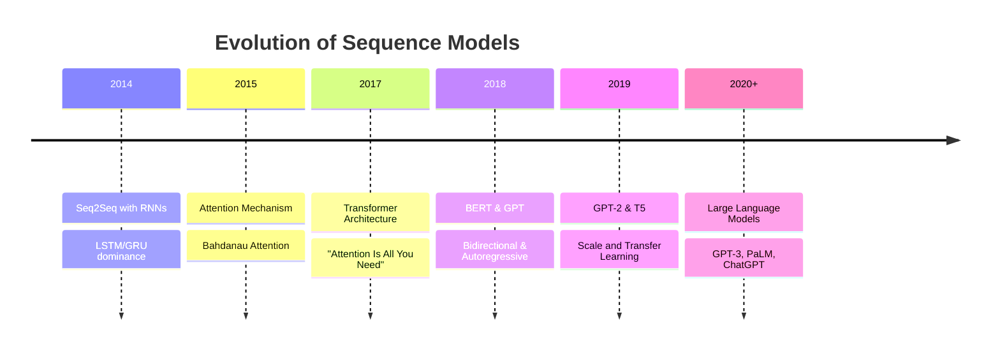
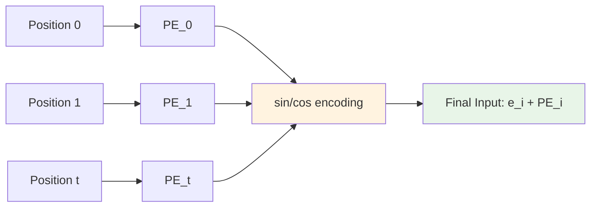
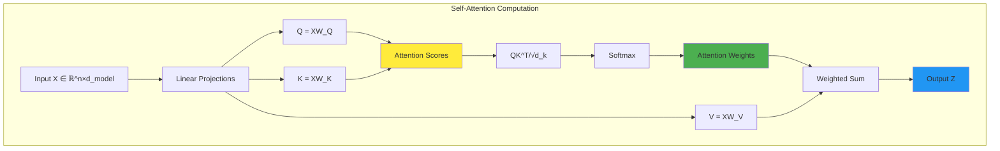
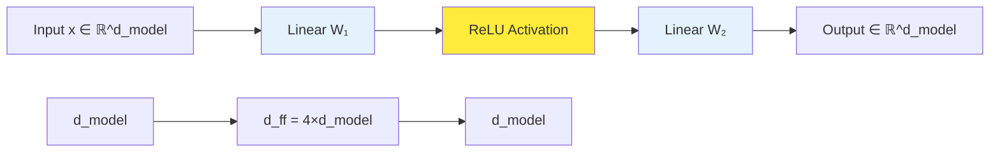
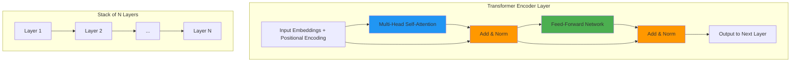
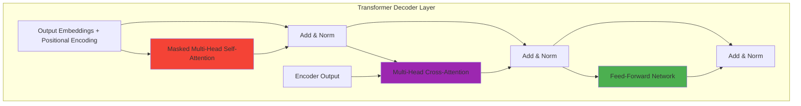
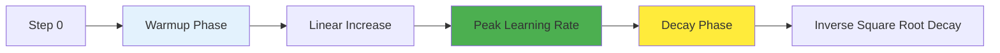

# Transformers in AI: Mathematical Foundations and Architecture

## Introduction

The Transformer architecture, introduced in the groundbreaking paper "Attention Is All You Need" by Vaswani et al. in 2017, has revolutionized the field of artificial intelligence and natural language processing. This architecture has become the foundation for state-of-the-art models like GPT, BERT, T5, and countless others that have transformed how we approach language understanding, generation, and beyond.



What makes Transformers particularly fascinating from a mathematical perspective is their elegant use of linear algebra, probability theory, and optimization techniques to solve the fundamental challenge of sequence modeling. Unlike recurrent architectures that process sequences step-by-step, Transformers leverage parallelizable attention mechanisms that can capture long-range dependencies efficiently.

This article provides a comprehensive mathematical treatment of the Transformer architecture, exploring the underlying mathematical principles, derivations, and computational complexities that make this architecture so powerful and widely adopted.

## Mathematical Foundations

### Vector Representations and Embeddings

The Transformer architecture begins with the fundamental concept of representing discrete tokens (words, subwords, or characters) as continuous vector representations in a high-dimensional space.

Given a vocabulary $V$ of size $|V|$, each token $w_i \in V$ is mapped to a $d_{model}$-dimensional embedding vector:

$$\mathbf{e}_i = \text{Embedding}(w_i) \in \mathbb{R}^{d_{model}}$$

The embedding matrix $\mathbf{E} \in \mathbb{R}^{|V| \times d_{model}}$ is learned during training, where each row represents the embedding of a specific token.

```mermaid
graph TD
    A[Token: "hello"] --> B[One-hot Vector]
    B --> C[Embedding Matrix E]
    C --> D[Dense Vector e_i ∈ ℝ^d_model]
    
    E[Vocabulary Size |V|] --> F[Embedding Dimensions]
    F --> G[Matrix E ∈ ℝ^|V|×d_model]
    
    style C fill:#e3f2fd
    style D fill:#c8e6c9
```

### Positional Encoding

Since Transformers lack the inherent sequential processing of RNNs, positional information must be explicitly encoded. The original Transformer uses sinusoidal positional encodings:

For position $pos$ and dimension $i$:

$$PE_{(pos, 2j)} = \sin\left(\frac{pos}{10000^{2j/d_{model}}}\right)$$

$$PE_{(pos, 2j+1)} = \cos\left(\frac{pos}{10000^{2j/d_{model}}}\right)$$

Where $j$ ranges from $0$ to $d_{model}/2 - 1$.



The complete input representation becomes:

$$\mathbf{x}_i = \mathbf{e}_i + \mathbf{PE}_i$$

## Self-Attention Mechanism

### Mathematical Formulation

The core innovation of Transformers is the self-attention mechanism, which allows each position in a sequence to attend to all positions, including itself. Given an input sequence $\mathbf{X} = [\mathbf{x}_1, \mathbf{x}_2, \ldots, \mathbf{x}_n] \in \mathbb{R}^{n \times d_{model}}$, self-attention computes:



The queries $\mathbf{Q}$, keys $\mathbf{K}$, and values $\mathbf{V}$ are computed as:

$$\mathbf{Q} = \mathbf{X}\mathbf{W}_Q, \quad \mathbf{K} = \mathbf{X}\mathbf{W}_K, \quad \mathbf{V} = \mathbf{X}\mathbf{W}_V$$

Where $\mathbf{W}_Q, \mathbf{W}_K \in \mathbb{R}^{d_{model} \times d_k}$ and $\mathbf{W}_V \in \mathbb{R}^{d_{model} \times d_v}$.

The attention function is then computed as:

$$\text{Attention}(\mathbf{Q}, \mathbf{K}, \mathbf{V}) = \text{softmax}\left(\frac{\mathbf{Q}\mathbf{K}^T}{\sqrt{d_k}}\right)\mathbf{V}$$

### Scaling Factor Analysis

The scaling factor $\frac{1}{\sqrt{d_k}}$ is crucial for numerical stability. Without scaling, the dot products $\mathbf{Q}\mathbf{K}^T$ can become very large, pushing the softmax function into regions with extremely small gradients.

**Mathematical Justification:**

Assuming $\mathbf{Q}$ and $\mathbf{K}$ have components that are independent random variables with mean 0 and variance 1, the dot product $\mathbf{q}_i^T\mathbf{k}_j$ has:

- Mean: $\mathbb{E}[\mathbf{q}_i^T\mathbf{k}_j] = 0$
- Variance: $\text{Var}[\mathbf{q}_i^T\mathbf{k}_j] = d_k$

By scaling by $\frac{1}{\sqrt{d_k}}$, we ensure the variance remains 1, preventing the softmax from saturating.

### Attention Score Interpretation

The attention weights $\alpha_{ij}$ represent the importance of position $j$ when computing the representation for position $i$:

$$\alpha_{ij} = \frac{\exp\left(\frac{\mathbf{q}_i^T\mathbf{k}_j}{\sqrt{d_k}}\right)}{\sum_{k=1}^n \exp\left(\frac{\mathbf{q}_i^T\mathbf{k}_k}{\sqrt{d_k}}\right)}$$

The output for position $i$ is then:

$$\mathbf{z}_i = \sum_{j=1}^n \alpha_{ij}\mathbf{v}_j$$

## Multi-Head Attention

### Mathematical Framework

Multi-head attention extends the self-attention mechanism by computing attention in multiple representation subspaces simultaneously. This allows the model to jointly attend to information from different representation subspaces at different positions.

```mermaid
graph TB
    subgraph "Multi-Head Attention Architecture"
        A[Input X] --> B[Head 1]
        A --> C[Head 2]
        A --> D[Head h]
        
        B --> E[Attention_1(Q₁,K₁,V₁)]
        C --> F[Attention_2(Q₂,K₂,V₂)]
        D --> G[Attention_h(Qₕ,Kₕ,Vₕ)]
        
        E --> H[Concatenate]
        F --> H
        G --> H
        
        H --> I[Linear Projection W_O]
        I --> J[Output]
    end
    
    style H fill:#ff9800
    style I fill:#4caf50
```

For each head $i \in \{1, 2, \ldots, h\}$, we compute:

$$\text{head}_i = \text{Attention}(\mathbf{Q}_i, \mathbf{K}_i, \mathbf{V}_i)$$

Where:
$$\mathbf{Q}_i = \mathbf{X}\mathbf{W}_i^Q, \quad \mathbf{K}_i = \mathbf{X}\mathbf{W}_i^K, \quad \mathbf{V}_i = \mathbf{X}\mathbf{W}_i^V$$

The projection matrices have dimensions:
- $\mathbf{W}_i^Q, \mathbf{W}_i^K \in \mathbb{R}^{d_{model} \times d_k}$
- $\mathbf{W}_i^V \in \mathbb{R}^{d_{model} \times d_v}$

Where typically $d_k = d_v = d_{model}/h$.

The final multi-head attention output is:

$$\text{MultiHead}(\mathbf{Q}, \mathbf{K}, \mathbf{V}) = \text{Concat}(\text{head}_1, \ldots, \text{head}_h)\mathbf{W}^O$$

Where $\mathbf{W}^O \in \mathbb{R}^{hd_v \times d_{model}}$ is the output projection matrix.

### Computational Complexity Analysis

The computational complexity of multi-head attention is:

**Time Complexity:** $O(n^2 \cdot d_{model} + n \cdot d_{model}^2)$

- Computing $\mathbf{Q}, \mathbf{K}, \mathbf{V}$: $O(n \cdot d_{model}^2)$
- Computing attention scores $\mathbf{Q}\mathbf{K}^T$: $O(n^2 \cdot d_k \cdot h) = O(n^2 \cdot d_{model})$
- Applying attention to values: $O(n^2 \cdot d_v \cdot h) = O(n^2 \cdot d_{model})$
- Output projection: $O(n \cdot d_{model}^2)$

**Space Complexity:** $O(n^2 + d_{model}^2)$

## Feed-Forward Networks

### Architecture and Mathematics

Each Transformer layer includes a position-wise feed-forward network (FFN) applied to each position separately and identically:

$$\text{FFN}(\mathbf{x}) = \max(0, \mathbf{x}\mathbf{W}_1 + \mathbf{b}_1)\mathbf{W}_2 + \mathbf{b}_2$$

Where:
- $\mathbf{W}_1 \in \mathbb{R}^{d_{model} \times d_{ff}}$ (typically $d_{ff} = 4 \cdot d_{model}$)
- $\mathbf{W}_2 \in \mathbb{R}^{d_{ff} \times d_{model}}$
- $\mathbf{b}_1 \in \mathbb{R}^{d_{ff}}$, $\mathbf{b}_2 \in \mathbb{R}^{d_{model}}$



### Activation Function Analysis

The ReLU activation function $\max(0, x)$ introduces non-linearity. Its derivative is:

$$\frac{d}{dx}\max(0, x) = \begin{cases} 
1 & \text{if } x > 0 \\
0 & \text{if } x \leq 0
\end{cases}$$

Alternative activation functions used in modern Transformers include:

**GELU (Gaussian Error Linear Unit):**
$$\text{GELU}(x) = x \cdot \Phi(x) = x \cdot \frac{1}{2}\left[1 + \text{erf}\left(\frac{x}{\sqrt{2}}\right)\right]$$

**SwiGLU (used in PaLM, LLaMA):**
$$\text{SwiGLU}(x) = \text{Swish}(x\mathbf{W} + \mathbf{b}) \otimes (x\mathbf{V} + \mathbf{c})$$

Where $\text{Swish}(x) = x \cdot \sigma(\beta x)$ and $\otimes$ denotes element-wise multiplication.

## Layer Normalization and Residual Connections

### Layer Normalization Mathematics

Layer normalization normalizes the inputs across the feature dimension for each individual example:

For input $\mathbf{x} \in \mathbb{R}^d$, layer normalization computes:

$$\mathbf{y} = \frac{\mathbf{x} - \boldsymbol{\mu}}{\boldsymbol{\sigma}} \odot \boldsymbol{\gamma} + \boldsymbol{\beta}$$

Where:
- $\boldsymbol{\mu} = \frac{1}{d}\sum_{i=1}^d x_i$ (mean)
- $\boldsymbol{\sigma} = \sqrt{\frac{1}{d}\sum_{i=1}^d (x_i - \mu)^2 + \epsilon}$ (standard deviation)
- $\boldsymbol{\gamma}, \boldsymbol{\beta} \in \mathbb{R}^d$ (learnable parameters)
- $\epsilon$ is a small constant for numerical stability

```mermaid
graph TB
    A[Input x] --> B[Compute Mean μ]
    A --> C[Compute Std σ]
    B --> D[Normalize (x-μ)/σ]
    C --> D
    D --> E[Scale & Shift γ⊙y + β]
    E --> F[Output]
    
    style D fill:#e3f2fd
    style E fill:#c8e6c9
```

### Residual Connections

The complete transformation in each Transformer layer includes residual connections:

$$\mathbf{z} = \text{LayerNorm}(\mathbf{x} + \text{MultiHead}(\mathbf{x}))$$
$$\mathbf{output} = \text{LayerNorm}(\mathbf{z} + \text{FFN}(\mathbf{z}))$$

The residual connections help with:
1. **Gradient Flow:** Preventing vanishing gradients in deep networks
2. **Training Stability:** Providing direct paths for gradient propagation
3. **Optimization:** Creating a smoother loss landscape

### Pre-Norm vs Post-Norm

Modern Transformers often use Pre-Norm instead of Post-Norm:

**Post-Norm (Original):**
$$\mathbf{output} = \text{LayerNorm}(\mathbf{x} + \text{SubLayer}(\mathbf{x}))$$

**Pre-Norm (Modern):**
$$\mathbf{output} = \mathbf{x} + \text{SubLayer}(\text{LayerNorm}(\mathbf{x}))$$

Pre-Norm generally provides better training stability and allows for deeper networks.

## Complete Transformer Architecture

### Encoder Architecture



The complete encoder layer transformation is:

$$\mathbf{h}^{(l)} = \text{LayerNorm}(\mathbf{h}^{(l-1)} + \text{MultiHead}(\mathbf{h}^{(l-1)}))$$
$$\mathbf{h}^{(l)} = \text{LayerNorm}(\mathbf{h}^{(l)} + \text{FFN}(\mathbf{h}^{(l)}))$$

Where $\mathbf{h}^{(0)} = \mathbf{X} + \mathbf{PE}$ (input embeddings plus positional encoding).

### Decoder Architecture

The decoder includes additional components for autoregressive generation:



**Masked Self-Attention:**

The decoder uses masked self-attention to prevent positions from attending to subsequent positions:

$$\text{MaskedAttention}(\mathbf{Q}, \mathbf{K}, \mathbf{V}) = \text{softmax}\left(\frac{\mathbf{Q}\mathbf{K}^T + \mathbf{M}}{\sqrt{d_k}}\right)\mathbf{V}$$

Where the mask matrix $\mathbf{M}$ is:
$$M_{ij} = \begin{cases}
0 & \text{if } i \geq j\\
-\infty & \text{if } i < j
\end{cases}$$

**Cross-Attention:**

Cross-attention allows the decoder to attend to the encoder's output:
- Queries come from the previous decoder layer
- Keys and Values come from the encoder output

## Training Objectives and Loss Functions

### Language Modeling Objective

For autoregressive language models (like GPT), the training objective is to maximize the likelihood of the next token given the previous tokens:

$$\mathcal{L}_{\text{LM}} = -\sum_{t=1}^T \log P(x_t | x_1, \ldots, x_{t-1}; \theta)$$

Where $P(x_t | x_1, \ldots, x_{t-1}; \theta)$ is computed using softmax over the vocabulary:

$$P(x_t = w | x_1, \ldots, x_{t-1}; \theta) = \frac{\exp(\mathbf{e}_w^T \mathbf{h}_t)}{\sum_{v \in V} \exp(\mathbf{e}_v^T \mathbf{h}_t)}$$

### Masked Language Modeling (BERT-style)

For bidirectional models like BERT, the objective is masked language modeling:

$$\mathcal{L}_{\text{MLM}} = -\sum_{t \in \mathcal{M}} \log P(x_t | x_{\backslash \mathcal{M}}; \theta)$$

Where $\mathcal{M}$ is the set of masked positions and $x_{\backslash \mathcal{M}}$ represents the unmasked tokens.

```mermaid
graph LR
    A[Original: "The cat sat on the mat"] --> B[Masked: "The [MASK] sat on the [MASK]"]
    B --> C[Prediction Loss]
    C --> D[Predicted: "cat", "mat"]
    
    style B fill:#ffeb3b
    style C fill:#f44336
```

### Cross-Entropy Loss Derivation

The cross-entropy loss for a single prediction is:

$$\ell(\mathbf{y}, \hat{\mathbf{y}}) = -\sum_{i=1}^{|V|} y_i \log \hat{y}_i$$

Where $\mathbf{y}$ is the one-hot encoded true label and $\hat{\mathbf{y}}$ is the predicted probability distribution.

For the gradient with respect to the logits $\mathbf{z}$:

$$\frac{\partial \ell}{\partial z_i} = \hat{y}_i - y_i = \sigma(\mathbf{z})_i - y_i$$

Where $\sigma$ is the softmax function.

## Optimization and Training Dynamics

### Adam Optimizer Mathematics

Transformers are typically trained using the Adam optimizer with learning rate scheduling. Adam maintains moving averages of the gradient and its squared magnitude:

$$\mathbf{m}_t = \beta_1 \mathbf{m}_{t-1} + (1 - \beta_1) \mathbf{g}_t$$
$$\mathbf{v}_t = \beta_2 \mathbf{v}_{t-1} + (1 - \beta_2) \mathbf{g}_t^2$$

With bias correction:
$$\hat{\mathbf{m}}_t = \frac{\mathbf{m}_t}{1 - \beta_1^t}, \quad \hat{\mathbf{v}}_t = \frac{\mathbf{v}_t}{1 - \beta_2^t}$$

The parameter update is:
$$\boldsymbol{\theta}_{t+1} = \boldsymbol{\theta}_t - \frac{\alpha}{\sqrt{\hat{\mathbf{v}}_t} + \epsilon} \hat{\mathbf{m}}_t$$

### Learning Rate Scheduling

The original Transformer paper uses a specific learning rate schedule:

$$\text{lr} = d_{model}^{-0.5} \cdot \min(\text{step}^{-0.5}, \text{step} \cdot \text{warmup_steps}^{-1.5})$$



This schedule provides:
1. **Warmup:** Gradual increase to prevent unstable training early on
2. **Decay:** Inverse square root decay for better convergence

### Gradient Flow Analysis

The gradient flow in Transformers benefits from several architectural choices:

**Residual Connections:** Provide direct gradient paths
$$\frac{\partial \mathcal{L}}{\partial \mathbf{x}^{(l)}} = \frac{\partial \mathcal{L}}{\partial \mathbf{x}^{(l+1)}} + \frac{\partial \mathcal{L}}{\partial \mathbf{x}^{(l+1)}} \frac{\partial f(\mathbf{x}^{(l)})}{\partial \mathbf{x}^{(l)}}$$

**Layer Normalization:** Reduces internal covariate shift and stabilizes gradients

**Multi-Head Attention:** Provides multiple gradient paths through different attention heads

## Advanced Mathematical Concepts

### Attention Pattern Analysis

The attention patterns can be analyzed through the lens of graph theory. The attention weights form a weighted adjacency matrix $\mathbf{A}$ where $A_{ij} = \alpha_{ij}$.

**Entropy of Attention Distribution:**
$$H_i = -\sum_{j=1}^n \alpha_{ij} \log \alpha_{ij}$$

Low entropy indicates focused attention, while high entropy indicates distributed attention.

**Attention Distance:**
$$d_{\text{att}} = \sum_{i=1}^n \sum_{j=1}^n \alpha_{ij} |i - j|$$

This measures how far attention typically reaches.

### Theoretical Approximation Properties

Recent theoretical work has shown that Transformers can approximate various function classes:

**Universal Approximation:** Transformers with sufficient depth and width can approximate any continuous function on compact domains.

**Turing Completeness:** Under certain conditions, Transformers can simulate Turing machines.

**In-Context Learning:** The attention mechanism enables a form of gradient-free learning within the forward pass.

### Information Theory Perspective

From an information-theoretic perspective, the attention mechanism can be viewed as performing soft information routing:

**Mutual Information:** The attention weights can be analyzed in terms of mutual information between query and key representations.

**Information Bottleneck:** Layer normalization and the FFN can be viewed as implementing information bottlenecks that preserve relevant information while discarding noise.

## Computational Complexity and Efficiency

### Detailed Complexity Analysis

**Memory Complexity:**

For a sequence of length $n$ and model dimension $d_{model}$:
- Attention scores storage: $O(n^2 \cdot h)$ where $h$ is the number of heads
- Activations storage: $O(n \cdot d_{model} \cdot L)$ where $L$ is the number of layers
- Parameter storage: $O(d_{model}^2 \cdot L)$

**FLOPs Analysis:**

Per layer FLOPs for forward pass:
- Self-attention: $4nd_{model}^2 + 2n^2d_{model}$
- Feed-forward: $8nd_{model}d_{ff} = 32nd_{model}^2$ (assuming $d_{ff} = 4d_{model}$)
- Total per layer: $36nd_{model}^2 + 2n^2d_{model}$

```mermaid
graph TB
    subgraph "Complexity Scaling"
        A[Sequence Length n] --> B[Attention: O(n²)]
        A --> C[FFN: O(n)]
        D[Model Dimension d] --> E[Parameters: O(d²)]
        D --> F[Computation: O(d²)]
        
        G[Memory Usage] --> H[Quadratic in n]
        G --> I[Linear in d]
        
        J[Computation] --> K[Quadratic in n for long sequences]
        J --> L[Quadratic in d]
    end
    
    style B fill:#f44336
    style H fill:#f44336
    style K fill:#ff9800
```

### Optimization Techniques

**Gradient Checkpointing:** Reduces memory by recomputing activations during backward pass
$$\text{Memory} = O(n \cdot d_{model} \cdot \sqrt{L})$$

**Mixed Precision Training:** Uses FP16 for forward pass and FP32 for gradient computation
- Reduces memory by ~50%
- Requires careful loss scaling to prevent gradient underflow

**Gradient Accumulation:** Simulates larger batch sizes:
$$\mathbf{g}_{\text{effective}} = \frac{1}{K} \sum_{k=1}^K \mathbf{g}_k$$

## Variants and Extensions

### Efficient Attention Mechanisms

**Linear Attention:**
Replace softmax with element-wise operations:
$$\text{Attention}(\mathbf{Q}, \mathbf{K}, \mathbf{V}) = \frac{\phi(\mathbf{Q})(\phi(\mathbf{K})^T\mathbf{V})}{\phi(\mathbf{Q})\phi(\mathbf{K})^T\mathbf{1}}$$

Where $\phi$ is a feature map (e.g., $\phi(x) = \text{relu}(x) + \epsilon$).

**Sparse Attention Patterns:**

```mermaid
graph TB
    subgraph "Attention Patterns"
        A[Full Attention O(n²)] --> B[Local Attention O(n×w)]
        A --> C[Strided Attention O(n×s)]
        A --> D[Random Attention O(n×r)]
        
        E[Longformer] --> F[Sliding Window + Global]
        G[BigBird] --> H[Local + Global + Random]
        I[Performer] --> J[Linear Attention via Features]
    end
    
    style A fill:#f44336
    style B fill:#4caf50
    style C fill:#4caf50
    style D fill:#4caf50
```

### Architectural Innovations

**RoPE (Rotary Position Embedding):**
Instead of additive positional encoding, RoPE applies rotation to query and key vectors:

$$\mathbf{q}_m = f(\mathbf{q}, m), \quad \mathbf{k}_n = f(\mathbf{k}, n)$$

Where $f(\mathbf{x}, m)$ applies rotation by angle $m\theta_i$ to dimensions $2i$ and $2i+1$.

**GLU Variants in FFN:**
$$\text{FFN}_{\text{GLU}}(\mathbf{x}) = (\mathbf{x}\mathbf{W}_1 + \mathbf{b}_1) \otimes \sigma(\mathbf{x}\mathbf{V}_1 + \mathbf{c}_1) \mathbf{W}_2 + \mathbf{b}_2$$

Where $\sigma$ can be sigmoid, swish, or other activation functions.

## Applications and Scale

### Language Models

**GPT Series Scaling:**
- GPT-1: 117M parameters
- GPT-2: 1.5B parameters  
- GPT-3: 175B parameters
- GPT-4: ~1.7T parameters (estimated)

The scaling relationship often follows power laws:
$$\text{Loss} \propto N^{-\alpha}$$

Where $N$ is the number of parameters and $\alpha \approx 0.076$.

### Scaling Laws

```mermaid
graph TB
    subgraph "Scaling Dimensions"
        A[Model Size N] --> D[Performance]
        B[Dataset Size D] --> D
        C[Compute C] --> D
        
        E[Optimal Scaling] --> F[N ∝ C^0.73]
        E --> G[D ∝ C^
